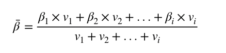
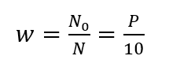
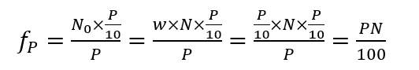
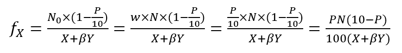
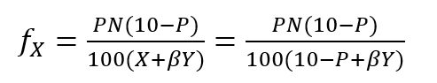
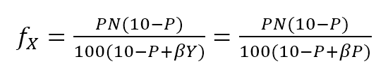
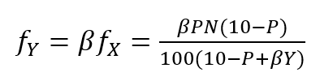

title: Economic Model of Qitmeer Test Net   
description: burning HLC, mining pmeer     
Status: v 1.08  

# Economic Model of Qitmeer Test Net

## Abstract

Qitmeer Network is a BlockDAG network based on PoW consensus algorithm. It is an exploration of integrating classical UTXO model and advanced DAG technology. Qitmeer's BlockDAG is a collaboration model based on SPECRE protocol. In mining, this collaboration model achieves an ideal balance between security, openness, fairness and scalability of classical blockchain measurement.

Qitmeer is an open block chain network. Qitmeer consensus abides by the classical blockchain settings: open, fair, secure and scalable. Free access to the network can be achieved by proof-of-work. BlockDAG's collaboration model allows solo mining and pool mining to have the same opportunity cost. At the same time, Qitmeer uses anti-ASIC mining algorithm to prevent concentration of hash rate.

Qitmeer testing network will introduce real miners for testing to ensure the gradual maturity and stability of the network. This is a gradual transition to the Qitmeer main network. The economic model of the test network should not only solve the incentive problems in the transition stage, but also solve the historical problems after the transformation.

## Introduction

### Definition

- HalalChain ERC20 token：HLC
- Qitmeer test net token：pmeer
-  Native token of Qitmeer network：Meer 

### Background

Qitmeer Network is a public chain transformed from HalalChain. HalalChain's original idea was to use Consortium Blockchain to implement business applications, and in the process of implementation, ultimately decided to transform and establish the underlying public chain. Qitmeer is an innovation and exploration of classical blockchain and a step forward from chain structure to graphic structure of blockchain.

Qitmeer test network is a transitional stage to the main network. On the one hand, at this period, we will introduce real miners' hashrate to test the Qitmeer network. On the other hand, we will complete the transition and mapping from HLC token (also and pmeer) to Qitmeer main network.

Economic Model of Qitmeer Test Net is a transitional scheme to the main network. During test network, one pmeer minted by miners, correspondingly, one HLC token burnt. The total number of pmeer and HLC remained at 1 billion. The number of pmeer which can be minted will be directly related to the number of HLC token which are burnt. At the end of the test network, the dual-channel mapping of HLC to Meer and pmeer to Meer will be established.

### Current Structure of HLC token

HLC token have been allocated via ICO, mainly in the following parts: the market part sold by ICO, development fund and development team award.

- the market part: personal assets that have confirmed ownership,assuming A.

- the development fund: public assets of the chain which will be used for ecological development,assuming B.

- the team award: personal assets that haven’t allocated,assuming C.

The exact number of A, B and C will be announced by HLC foundation, A+B+C=1 billion.

## Modeling Design

### Goals and Rules

The spirit of the blockchain is full decentralization and community governance. As a public chain, Qitmeer will follow this spirit in the design of its economic model. Therefore, the Qitmeer test network economic model will be a free game model of the community rather than a model dominated by a fund.

The core idea of this model is to attract real miners to test the Qitmeer network, on the other hand, to determine the mapping proportion of the whole Qitmeer network according to the number of HLC token burnt. The final result is obtained by the free game of all parties. The whole process follows the following rules:

- **Burning and mining**: one HLC token burnt, one pmeer can be minted by miners.

- **Constant total number**: the total amount of pmeer and HLC remains at 1 billion, pmeer + HLC = 1 billion.

- **Exchange freely**: pmeer holders and HLC holders can exchange freely on their own initiative.

- **Mapping priority**: the HLC participating in burning will obtain the priority of mapping, it means giving them priority according to its proportion in the network at the time of allocation.

### Total Number of pmeer

We adhere to the principle of constant total amount, value will not arise out of nothing, nor will it disappear for no reason. The total number of pmeers allowed to be minted will be determined by the number of HLC that would be burnt. It means the real output of pmeer is less than or equal to the number of HLC that have been burnt.

- Assuming that the total number of HLC tokens and pmeers in the market at a certain time is X hundred million and Y hundred million, then X+Y = 10.

- Assuming that the number of HLC which would be burnt is P hundred million, then the maximum number of pmeer is P hundred million. It means Y ≤ P.

### Burning of HLC Token

Since the total number of pmeer allowed to be minted will be determined by the number of HLC that have been burnt, a burning pool will be established. Everyone of HLC holders can participate in HLC burning. All HLC tokens transferred into burning pool during the test-net period will be directly eligible for the main network mapping, and will be able to obtain priority options and other preferential rights in mapping.

In order to ensure that all users participating in HLC burning can obtain corresponding rights and interests, each user participating in HLC burning will receive a certificate of burning, which can be used to participate in the main network mapping and obtain other preferential rights and interests.

For the convenience of description, we will replace the HLC token to be burnt with B-HLC.

The burning of HLC token is not only free, but also a process of self-game and multi-party game. The number of HLC tokens that burnt will determine the values of the following three parameters:

1. The proportion of the test network in the whole main network
2. Mining period of test network
3. The Weight Ratio of B-HLC when mapping to main network

If 200 million HLC tokens were burnt,

1. The proportion of test network in the whole main network will be 20%.
2. The mining period of the testnet will be about 18.5 months (calculated by 120 seconds of block time and block reward 520, i.e. mining period T = 200000000 ÷ 520 × 120 ÷ 3600 ÷ 24 ÷ 30 = 17.8 months);
3. The weight ratio of B-HLC when mapping to main network will be 20%. The remaining 80% is used for the mapping of HLC token and pmeer holders. The mapping ratio and relationship will be reflected by the game design below.

### Exchange of HLC token and pmeer

PMEER holders and HLC holders can exchange freely on their own initiative. If there is a _β_ satisfying the following conditions:

**1 pmeer = _β_ HLC**.

Among them, _β_ reflects the value inequality of the two. The value of _β_ will be calculated by the weighted average value according to their daily exchange volume.

Assuming that the exchange volume of pmeer and HLC on day i is vi and ni, respectively. So,

day(i) | total volume of pmeer (vi)| total volume of HLC (ni) | _β_i 
------|--------|--------|-------
1 | v1 | n1 | _β_1=n1/v1
2 | v2 | n2 | _β_2=n2/v2
... | ... | ... | ...
i | vi | ni | _β_i=ni/vi

The weighted average of _β_  is:

The _β_ reflects the value inequality of the two, which will ultimately be reflected in the difference of the mapping ratio of them.

### Mapping Rules

- Determination of the mapping proportion (w) in the whole Qitmeer network

  Assuming that the total number of meers is N hundred million, and the total number of meers that mapped to HLC, pmeer and B-HLC as a whole is N0 hundred million. So **N0 = w · N**. 

  The number of B-HLC determines the quantity of pmeer that can be minted at the expense of liquidity, while HLC and pmeer have the potential to profit in the market. Therefore, the value of w is mainly determined by the number of the HLC token to be burnt (i.e. B-HLC), i.e. **w = P/10**.
 
  
  

- Determination of mapping ratio (f)

  Define mapping ratio f: The number of meers obtained when a single token mapping, i.e. **1 token = f meer**. 
  
  The mapping proportion of HLC, pmeer and B-HLC (HLC to be burnt) in the main network is w, and the corresponding number of meers is N0. The P hundred million of HLC that burt will take the priority of P/10 share, and the remaining (1-P/10) share will be shared by HLC and pmeer.
  
  **mapping ratio of B-HLC (fP)**:
  
  
  
  **mapping ratio of HLC (fX) and that of pmeer (fY)**:
  
  since 1 pmeer = _β_ HLC, so Y pmeer = _β_ Y HLC. Assuming that the mapping ratio of HLC token is fX and that of pmeer is fY, then fY=_β_ fX. Therefore:

  
  
  since X = 10 - P, so:
  
   
  
  In view of the principle of constant total amount, **the final value of Y is based on the maximum output of pmeer, that is Y = P**. Therefore, the final mapping ratio mainly depends on the P value. Namely： 
  
  
  
    and
    
  

### Parameter Setting

- **Block time t**: A block time is the interval time that a new block generate. This will be the result of a comprehensive consideration. 

  In PoW, this value is statistical, the actual situation is sometimes large and sometimes small, in Bitcoin, the statistical expectation is 10 minutes. The determination of this value needs to take into account the block broadcast delay, which not only ensures the security of transaction confirmation, but also reduces the fork rate. In the current Internet environment, it takes about 10 seconds to broadcast to more than 90% of the nodes. At the same time, the value also guides the direction of difficulty adjustment. When the real block time (the average value of a period of time) is less than t, the difficulty will increase; otherwise, the difficulty will be reduced. 

  Qitmeer adopts a hybrid consensus that combines SPECTRE and GHOSTDAG in order to achieve fast confirmation and high throughput. Compared with Bitcoin, the block time has been significantly reduced, and the throughput has also been significantly improved. In Qitmeer test network, the block time is tentatively set at 120 seconds.
     

- **Block reward r**: A block reward is the rate of growth of the token pool, representing the number of reward tokens a miner can obtain from a single block, and is of central interest. 

  On the surface, the property of block rewards is that they add to the total token supply. But more importantly, it ensures a long-term economic viability of network, which provides sufficient incentives for user adoption and participation of miners. In a new system, funding of network functions would mainly rely on the block rewards.

  The block reward setting during Qitmeer test network is related to the amount of tokens planned to be issued and the duration of the plan. Considering the comprehensive factors such as mining cost and token supply rate, after comprehensive trade-offs, the block reward during Qitmeer test network is set at 520 pmeer per block.

  In the case of block rate is 120s of each block, and block reward r = 520 tokens, the total output of tokens in one year will be about 136.656 million. It would be 374.4 thousand in one day.

  It is worth mentioning that because Qitmeer's BlockDAG model is a collaboration model, the block reward may no longer be exclusive to a certain miner, and the block reward will be distributed gradiently according to whether or not it is on the main chain. 
  
- **Difficulty of mining**: The process of PoW mining is actually a random hash collision process, looking for a solution less than the target hash value. The probability of finding a solution that satisfies the condition is the difficulty of mining. This difficulty value will be adjusted automatically according to certain rules with the change of hashrate to ensure the stability of block time.

  The initial difficulty of test net mining is based on the participation of ordinary computer, which can be adjusted automatically with the increase of hashrate.

### Termination Conditions of Test Network

With the steady running of Qitmeer test network, when some of the following conditions are met, the test network will be terminated and Qitmeer main network will be started. 

- Time Indicators: The maximum running time of the test network is not more than 18 months, and the corresponding block height is about 388800. In view of the principle that how much is burnt, how much should be mined, this indicator does not exclude adjustment according to actual situation.

- Total Amount Index: Since the total amount of pmeer generated during the test network is determined by the number of HLCs which would be burnt (that is, the number of B-HLCs), the termination condition will be triggered if the actual production of pmeer reaches the upper limit of the number of B-HLCs ahead of the time.

- Development Progress of Main Network: If the development of Qitmeer main network is successful, the network and ecological development are healthy and stable for a long time, community consensus can be reached according to the actual situation to terminate the operation of the test network.

## Version History

- 2019/08/03  v1.01 : initial darft
- 2019/08/16  v1.02 : update config
- 2019/08/21  v1.03 : update structure
- 2019/08/22  v1.04 : update config
- 2019/08/28  v1.05 : update config
- 2019/08/30  v1.06 : modify config
- 2019/09/07  v1.07 : update config
- 2019/09/07  v1.08 : update config