title: Economics of Qitmeer Umayyad Network 1.0      
Authors：yatingzhou and blocklee and yujie, Qitmeer Economic Team        
Version: 1.71       
October 21, 2021     

# Economics of Qitmeer Umayyad Network 1.0

## Preface

Qitmeer Network is committed to form a global financial inclusion system and Ethical Finance by adhering to the financial values of neutrality and universality and the blockchain spirit of equality and openness. The Qitmeer Network is divided into four periods: the Mecca era of awakening and enlightenment, the Medina era of innovation and exploration, the Umayyad era of maturity and stability, and the Abbasid era of prosperity.

The development needs of each period are different and unpredictable, so it is difficult to fully plan in advance. We need to make adjustments in stages by combining the needs and status quo of different periods.The Umayyad era is the period when the main network of Qitmeer is officially launched and the result of the integration of the two value carriers, HLC and Pmeer, into one, symbolizing the maturity and stability of the soul and mind of the Qitmeer Network. During this period, the infrastructure construction will be gradually completed, the establishment of rules and regulations will be started, and the upper ecological construction will be greatly expanded, laying the foundation for the prosperity of the Abbasid era.

The following discussion center on the amount of Qitmeer Umayyad Network base coins, the Genesis and mapping rules of Qitmeer Umayyad Network 1.0, Qitmeer Umayyad Network 1.0 release rules, and "Majority Game Model" design. We will discuss in detail.

## 1. Qitmeer Umayyad Network Economic Overview

### 1.1 Qitmeer Umayyad Network Base Coin Amount

The Qitmeer Umayyad Network's base coin is named Meer (initial capitalization), and meer (initial lowercase) is also the common unit of count for the base coin, and the smallest unit of count for the base coin is qit, with 1 meer = 100000000 qit. Network's total number of base coins (denoted as N) is set to 210,240,000 meer, i.e., N = 210.4 million meer.

Qitmeer Umayyad Network's base coin can be divided into a Genesis section and a New-minted section. The Genesis section can be divided into a mapping section and a team incentive section. The mapping part involves a set of algorithmic rules and includes the definition and processing of dust accounts; the Genesis part also involves the issue of how to release; and a fun storage incentive mechanism is set for the Qitmeer Umayyad Network coin. Each of them is explained in detail below.

### 1.2 Qitmeer Umayyad Network Economic Philosophy

The Qitmeer Umayyad Network 1.0 is in a period of infrastructure development, where the supply is greater than the demand. In this stage, miners are the producers in the economic system and also have to play the role of demanders. We will build a self-organizing and mutual-feedback mechanism of production demand. Historically, similar mutual-feedback mechanisms have shaped some typical economic systems, such as the spontaneous construction of the U.S. railway network. When demand is insufficient in the present, the identities of producers and consumers can overlap, with the key factor being expectations for the future. When the supply in the system is greater than the demand, the economic mechanism should be designed with an eye on the implicit demand, i.e., how can expectations be better served as demand? How can demand contribute to the development of supply in turn? One direct way to design the system is through economic macroeconomic regulation.

However, for a decentralized economic system, macroeconomic regulation should be integrated with the "invisible hand" rather than introduced as a mere externality. The integration of microeconomics and macroeconomics in a specific economic system also implies a set of imaginative designs. We will focus on this in the fourth point on "majority game model" game design.

Traditional economics emphasizes the law of "diminishing marginal utility," but economists have been aware of the theory of increasing returns for more than 100 years, since Alfred Marshall's 1890 Principles of Economics introduced a counterpart to the theory of increasing returns. But in fact, mainstream economists have a preference for models with a single equilibrium solution, a preference that conflicts with the idea of "increasing returns".

" Increasing returns" is mainly driven by innovation, the basic guarantee is to form a positive cycle, the so-called "positive feedback". Positive feedback is a cycle of acceleration, amplification and self-reinforcement, while negative feedback is a cycle of deceleration, inhibition and self-restraint. Traditional economics assumes that the economic process is dominated by inhibitory negative feedback. However, the real world also exhibits positive feedback or increasing returns. For example, the more information available on the Web, the more useful the site itself becomes; the more people buy a particular stock, the more people will compete to catch up.

The economic system of Qitmeer Umayyad Network 1.0 is designed to guide the evolution of the main network into some kind of "positive feedback" cycle, so that the expectation of the future gradually changes from a demand role to a production role; and, with some kind of incentive mechanism as a guide, the distribution of token resources spontaneously evolves into the generation and refinement of token value. This process is the core objective of Qitmeer Umayyad Network 1.0 development.

## 2. The Genesis and Mapping Rules of Qitmeer Umayyad Network 1.0

The entry of the Qitmeer Network into the Umayyad era symbolizes the network's maturity and stability, thanks to the foundation laid during the Mecca and Medina eras. Therefore, at the start of the Umayyad Network, a portion of Meer needs to be created first to inherit the values transferred from the Mecca and Medina eras.

Both Mecca-era tokens (HLC) and Medina-era tokens (Pmeer) will be converted into main network tokens (Meer) at a certain ratio. According to the rules of Qitmeer Medina Network Economic-model, the proportion of the whole Mecca era and Medina era in Qitmeer Network is 20.0287911%, which is a value obtained by democratic decision-making at the beginning of Medina Network. In other words, 20.0287911% of Meer needs to be created for mapping at the time of Umayyad Genesis. That is, the total amount of Meer for mapping is: N0 = 20.0287911% × 210240000 = 42108530.40864 meer.

In addition, 4% Meer will be created at the same time as an incentive for the Founding team. 

Therefore, the total number of Qitmeer Network Genesis during Umayyad is: Ng = N0 + 4%N = 50518130.40864 meer.

Since there are many abandoned dust accounts(as defined in 2.1.2) for HLC and Pmeer, there is no need to do the mapping, so the actual total amount of Qitmeer Genesis will be rounded to 50518130 meer, which is about 24% of the total number of Qitmeer base coins.

The rules involved in the mapping section and the founding team incentive section are explained below.

### 2.1 Mapping Section

#### 2.1.1 Mapping Ratio  

The Mecca era and the Medina era played an exploratory and transitional role in the development of the Qitmeer Network and were important in the process of Qitmeer becoming a public chain with an autonomous standard. The tokens that existed during the respective periods were not mapped in the same ratio due to their different roles and values, and were not mapped with equal weight. The respective mapping ratios are determined by the rules of the economic model of the Medina era.

For the HLC Token (called B-HLC) have burned in Medina era, the mapping ratio of a single token is 0.04210853, that is, 1 B-HLC can be redeemed for 0.04210853 meer, and this part can be mapped to about 8433829 meer in total.

For the unburned HLC tokens and Pmeer tokens, they can be mapped to a total of 33674700 meer, where the mapping ratio of a single HLC Token is 0.01617033, i.e. 1 HLC can be redeemed for 0.01617033 meer; the mapping ratio of a single Pmeer Token is 0.10356637, i.e. 1 Pmeer can be redeemed for 0.10356637 meer.

#### 2.1.2 Dust Account

Considering that there are some accounts in HLC and Pmeer networks with very small balances generated by testing, which have become abandoned accounts due to their very small balances, we call such accounts dust accounts. For the dust accounts, because their balance is too small, the balance after mapping is also basically negligible, and most of these accounts are abandoned, it is meaningless to do mapping for them, which will only consume network resources for nothing. Therefore, instead of mapping the dust accounts, the dust balances will be grouped together in the network Eco-fund.

- 2.1.2.1 HLC Dust Account Definition

Currently, HLC has 1913 holding addresses on-chain, of which the balance of the latter 913 addresses are less than or equal to 50HLC. Among all the holding addresses, there are 679 addresses whose balance is equal to 50hlc, and 38 addresses whose balance is greater than or equal to 5 but less than 50hlc; There are 3 addresses whose balance is equal to 5 and 224 addresses whose balance is less than 5; 210 addresses with balance less than or equal to 1 ([Data source](https://www.oklink.com/eth/token/0x58c69ed6cd6887c0225d1fccecc055127843c69b)).

Since there are a total of 224 addresses with address balance less than 5 HLC, but there are 210 addresses with balance less than or equal to 1. The swapping amount of 5 HLC after mapping is also about 0.1 meer. Comprehensive energy efficiency ratio, we propose to define the HLC accounts with account balance less than 5 as dust accounts, i.e., **the criterion of HLC dust accounts is set as HLC < 5**.

- 2.1.2.2 Pmeer Dust Account Definition

There are many Pmeer accounts with very small balances. Out of a total of 3500 addresses, there are 1696 addresses with balance less than 1 Pmeer. Among them, there are 380 addresses with balance greater than or equal to 0.1 and less than 1 Pmeer; 1318 addresses with balance less than 0.1 Pmeer; 1044 addresses with balance less than 0.01 Pmeer, and 652 addresses with balance greater than or equal to 0.01 and less than 1 Pmeer. ([Data source](https://explorer.qitmeer.io/))

Among the 1,696 accounts with address balance less than 1Pmeer, there are some accounts with balance of 0.1 or 0.0999, which are mining addresses that have participated in mining pool mining, but have not continued mining due to too little hashrate, and there is only one transaction from miner in the account. These accounts are likely to become abandoned accounts as well. In addition, there are many accounts with even smaller balances, most of which were generated for testing purposes and have become abandoned accounts. Even if these accounts are mapped, most of them will have a balance of less than 0.01 after mapping.

Comprehensive energy efficiency ratio, we classify accounts with Pmeer balances less than 1 as dust accounts, i.e., **the criterion of Pmeer dust accounts is set as Pmeer < 1**.

In short, addresses with account balances less than 5 HLC or less than 1 pmeer will be defined as dust accounts and will not be mapped. The dust balance will be grouped into the network Eco-fund.

(_Note: the above statistics may change somewhat depending on the point in time, but the statistics on tiny accounts will not be affected_)

### 2.2 Founding Team Incentive 

At the Genesis of Umayyad 1.0 network, 4% of the total number of Meer will be created at the same time as an incentive for the founding team, totaling 8409600 meer. The team incentive part is not a one-time payment and follows the same release rules as the mapping part.

## 3. Qitmeer Umayyad Network 1.0 Release Rules

### 3.1 Release Amount

At the initial stage of the Umayyad Network launch, a one-time Genesis generation of about 24% of Meer will be used mainly for mapping redemption for Mecca and Medina Network holders, and team incentives. Since Qitmeer is a PoW-based consensus network and the Umayyad Network uses a new ASIC-friendly mining algorithm, we need to mitigate the one-time impact of this 24% Genesis amount on the market in order to ensure the stable growth of miners, considering the stability of the Umayyad Network, so we will adopt a linear release process for this part of the Genesis balances. The maximum amount of linear release is 50518130 meer.

### 3.2 Release Rate

For all accounts requiring linear release, the release rate will remain at a total release of about 28,800 meer per 2,880 main heights, which is similar to the total output of PoW per 2,880 main heights, with a total annual release of approximately 20.81% of the total Genesis. That is, the annual release of individual accounts is 20.81% of their total balances. During the specific release, this 20.81% will be split into multiple UTXO positions according to certain split units, which will be released multiple times in one year by random arrangement.

### 3.3 Release Unit

Due to the large number of releases in linear release, we cannot split too many UTXO positions considering the carrying capacity of the network, we will split them in units of 1000, i.e. for accounts with 20.81% of the total account amount less than or equal to 1000 meer, this 20.81% will be released as one UTXO position at one time and will be randomly arranged in the annual release queue.

This release scheme is the temporary release scheme of Qitmeer Umayad 1.0. Later, according to the actual situation of Umayyad Network development, the release rules will be adjusted before Qitmeer Umayyad 2.0 network is launched, taking into account the user requirements and network conditions.

## 4. Qitmeer Umayyad Network 1.0 "Majority Game Model" Design

During the first year of the Umayyad Network, a fixed one-year staking lock-up plan will be implemented to provide coin holders with the ability to resist inflationary losses and the opportunity to earn more, as well as to regulate network liquidity to ensure the stability of PoW miners. The plan will be designed as a non-zero-sum game similar to the majority game model, as opposed to the famous "El Farol Bar model", which will result in a majority benefit, or even a collective benefit.

Users can choose to participate in locking a certain amount of Meer at any time on their own, thus receiving an ongoing lock-up bonus. The end of the first-year's staking lock-up plan also marks the end of the Umayyad Network 1.0, and we refer to the blocks at the end of the first-year's staking lock-up plan as the critical block. Prior to the critical block, 50% of the block rewards will be used for PoW incentives and the other 50% of the block rewards will be used for staking lock-up rewards.

### 4.1 Economic Significance

#### 4.1.1 Economic Dynamics in the "majority Game Model" 

Umayyad 1.0 is in the infrastructure construction phase, where the supply of the market is greater than the demand, and therefore the amount of coins in circulation needs to be reduced to fight inflation. The idea of how to adaptively reduce the amount of coins in circulation to conform to the market, rather than introducing some kind of control as a mere externality, is an important concept in the design of economic system. The main point is to give the holders of coins sufficient choice.

We provide an available deposit mechanism whose interest rate on deposit is floating and fundamentally depends on the comprehensive expectation of the holders, and is directly in reverse proportional to the current volume of deposits. Two typical cases exist as adaptive forces regulating the volume of currency in circulation: 1. if the comprehensive expectation of the holders is higher in the current market, there will be fewer deposits and the interest rate will be higher, which in turn attracts more deposits and thus reduces the volume of circulation; 2. conversely, if the comprehensive expectation of the holders is lower for the current market, the total amount of current deposits will become larger and the interest rate will be relatively lower, which in turn limits the increase in deposits and ensures a certain amount of circulation. In summary, the above two judgments on the current market and expectation for the future form the first dynamic game pair.

Since in Umayyad 1.0, the supply capacity of the network is greater than the demand, we prefer to encourage deposits in order to fight inflation, and thus for the 2nd case above, we set a stepped deposit rate that increases along with the total storage volume.

Miners play a leading role in market expectation, however, the PoW mechanism makes the number of miners will reach a bottleneck in a predictable time and the leading effect of miners on the market will gradually become weaker. In this way, we design to divide the coinbase reward into two parts, one of which is awarded to the depositors as interest. In this way, it reduces the amount of coin circulation on the one hand, and also makes the pledger become another label for the miner, which indirectly reduces the bottleneck of miner scale brought by PoW mechanism. Just like alchemy is to mining, although the amount of gold is reduced, but the total value of gold can be improved, and, from mining to alchemy is divided from a single into two, also indicates that the system towards the development of rich diversity.

#### 4.1.2 Collaborative Facilitation and Anti-monopoly Effects of the "Majority Game Model"

Modern economy has evolved from simple human interaction to a very complex system. Capital manipulators can use the freedom of economy to intervene in it and make wealth flow in their favor. When intervention becomes common, the microeconomic strategies of different actors can trigger short-term macroeconomic effects that can adversely affect the market. This is an important issue that Qitmeer Umayyad Network 1.0 is designed to address.

Today, game theory has become the common language of economists. Several versions of the "minority game" -- in which individuals choose between two possibilities and the option favored by the fewest individuals is the winning choice -- have been proposed and studied. The lock-up game during Umayyad 1.0 stage combines the characteristics of a minority game and a majority game.

Luís Seoane, from the Spanish National Center for Biotechnology, studied "manipulated" economies and the dynamics within them by building a game model. His research shows that increasing the number of games in an economic system increases the degrees of freedom in the economy and thus enriches its complexity. Therefore, the competition in the game "majority game model" of Umayyad 1.0 stage is also divided into multiple games.

Luís Seoane's research shows that small economies generate individuals with different strategies and that the winners usually tend to be in the minority; as the economy grows larger, individuals can acquire more wealth and pay the intervention costs required to manipulate the game. Thus, individuals move from a game of the few to a game of the many, which means that economic growth leads to a transition to collaborative relationships among individuals, i.e., "cartel" formation, and a subsequent decline in strategic diversity. If complexity grows faster than the economy, the relative benefit of each game will decrease and individuals will look for the option favored by the minority in multiple games. This shift will lead to the disintegration of the "cartel" and a greater diversity of strategies available to individuals. Similarly, as the system evolves, the game mechanism in Umayyad 1.0's lock-up game will shift between a minority game and a majority game.

Luís Seoane's theory shows the important corollary that when the total amount of economic intervention in each game is constant, the size of the economy increases linearly with the number of games, which is in line with the core development objective of Qitmeer Umayyad Network 1.0. Moreover, the theory reflects how informationally disadvantaged individuals can use the generation of collaboration to their advantage. As the history of the medieval mercantile guilds shows, the weaker players manipulate the system in this way, and these institutions resist the unbridled expropriation of powerful local rulers through joint embargoes, proving that a manipulated economic environment does not necessarily mean that the little guy has no chance against the strong.

### 4.2 Game Rules

#### 4.2.1 Rule Elements

- (1) Voluntary lock-up model, where you can buy Meer from the market to join the lock-up at any time to gain lock-up revenue.

- (2) The lock-up portal will be opened after the Genesis of Umayyad, and the lock-up portal will be closed appropriately early before the critical block according to the actual situation.

- (3) Two lock-up pools will be established, A and B, of which A is the miner staking pool by default and named the guard pool; B is the lock-up pool of general coin holders and named the glory pool.

- (4) At the end of each period, the basic incentive of that period will be equally distributed to pool A and B.

- (5) At the end of each period, the competition winning pool will be confirmed according to the newly added locking amount of pool A and B in the current period.

- (6) The maximum main height of the lock-up period is 1080000, and all the funds and incentives involved in the lock-up period will be unlocked uniformly when Umayyad 2.0 goes online.

- (7) The critical block is the 1080000th block of the main chain height of Umayyad 1.0.

#### 4.2.2 Rule Details

In game theory, rational individuals make choices and behaviors that are often dependent on the choices and behaviors of other participants, and then react on other participants. Each individual is the environment of the others, and a competitive market is actually a game equilibrium for all participants. With the game as the underlying logic and the appropriate design of the mechanism, the competitive situation can also produce a multi-win effect and promote the stable growth of the Qitmeer Umayyad Network market.

Therefore, we give a set of gamification settings for locking positions and their incentives based on the basic theory of non-perfect information non-cooperative dynamic games. We will set up two lockup pools, A and B, and allocate lockup incentives each period according to the lockup of each pool. The lock-up incentive received by users will consist of two parts: the basic incentive and the competitive incentive. By default, pool A is a staking pool for miners, while pool B is a staking pool for regular coin holders. The basic incentive for the current period will be equally distributed to pool A and B, and then proportionally distributed to all the current cumulative lock funds based on the amount and lock time of each.

A certain threshold will be set for the basic incentive allocation of each period, i.e., the higher the locking amount, the more incentive will be obtained. And only when the cumulative locking amount reaches the corresponding threshold, the corresponding percentage of basic incentive can be obtained.

Poll A and B will compete for the winner according to the newly added locking volume in each period, and the winner will get the competition incentive in the current period. If the newly added locking volume of pool A is larger than pool B in the current period and the difference is higher than 10,000 meer, pool A will get the competitive incentive as the winner; if the newly added locking volume of pool B is larger than pool A in the current period and the difference is higher than 10,000 meer, pool B will get the competitive incentive as the winner; if the difference is less than 10,000 meer, there is no winner and the competitive incentive in the current period will be allocated to the eco-fund. The competitive incentive received by the wining locking pool will be allocated to the current period's newly added locking funds in proportion to the amount of each locking funds in this pool.

#### 4.2.3 Locking Address

- Locking address of Guard pool (pool A) : [MmQitmeerMainNetGuardAddressXd7b76q](https://github.com/Qitmeer/qitmeer/pull/658/commits/6a786b65e71fc49b48b4ccd40549532666424b4f)

- Locking address of Glory pool (pool B): [MmQitmeerMainNetHonorAddressXY9JH2y](https://github.com/Qitmeer/qitmeer/pull/658/commits/6a786b65e71fc49b48b4ccd40549532666424b4f)

The above two locking address are black hole addresses and no one has the private keys for these two addresses, therefore, all the locked funds will be returned at the Genesis of Umayyad 2.0 based on the locking records.

### 4.3 Game Incentive

#### 4.3.1 Incentive Source

In the Qitmeer Umayyad 1.0 network, 50% of the block reward will be used as an incentive for miners in return for providing hardware equipment to maintain the network; the remaining 50% of the block reward will be used for the establishment of the staking locking model and other incentives.

The average block time for the Qitmeer Umayyad Network 1.0 is set to 30 seconds, and the initial block reward for each block is set to 20 meer. With this setting, the initial daily output of Qitmeer is approximately 57,600 meer, with 50% going to PoW miner incentives and 50% to lock-up incentives and other incentives. Since Qitmeer's MeerDAG protocol supports concurrent blocks, the actual daily output volume will be greater than 57,600 meer.

Before the critical block, approximately 10,800,000 meer (later referred to as total available funds) will be available for voluntary lock-up incentives, the specific amount should be depending on the actual output before the critical block. Since the lock-up incentive funds are produced gradually with the block rewards, these funds will be collected in the Qitmeer eco-fund first, locked on the chain, and will only be finally cashed out when Umayyad 2.0 goes online.

#### 4.3.2 Incentive Allocation

The lock-up incentive is divided into 12 periods, and the lock-up incentives of each period increases linearly, with the exact time in blocks, and each period is separated by 90,000 main chain heights, which is about one month. The lock-up incentive of each period is increasing, and the total lock-up incentive of the xth period is set as (x+1)% of the total available funds. 90% of the lock-up incentive of each period is used as the basic incentive, and the other 10% is used as the competitive incentive. The total incentive amount is 97,200,000 meer, which is 90% of the total available funds.

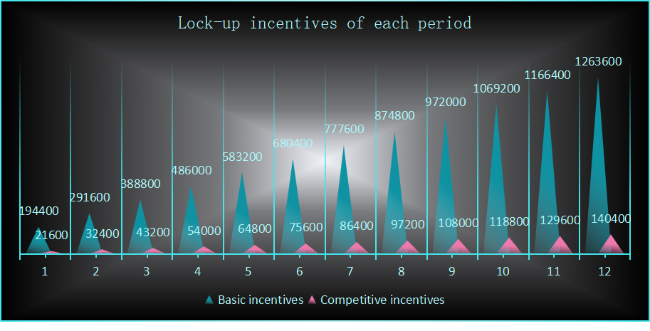

The lock-up period lasts until the 1,080,000th block of the main height, after which there will be no more lock-up rewards.

At the end of each period, the profit of the locking funds for that period will be liquidated and vouchers will be generated to be used as the basis for cashing out at the Genesis of Umayyad 2.0. The basic incentive available for the current period will be equally distributed to pool A and B, and then distributed to all current accumulated locking funds in proportion to the amount of each locking funds and the locking time. 

Considering the reasonableness of the incentive and the assessment of the lock-up level, a certain threshold will be set for the allocation of the basic incentive in each period, i.e. the higher the locking amount, the more incentive will be obtained. Only when the total accumulated locking amount reaches the corresponding threshold, the corresponding level of basic incentive can be obtained. The total amount of basic incentive that can be obtained by the two pools in the current period can be determined based on whether the total accumulated locking amount of the two pools in the current period reaches the corresponding threshold level, and then distributed in half to pool A and B afterwards. The basic incentive that each pool has received for each period will be allocated to all the current accumulated locking funds. For the current period, the portion that cannot be obtained because the threshold level is not reached will be allocated to the Eco Fund.

The threshold is set with respect to the total theoretical production, which is the sum of the theoretical PoW output and the theoretical linear release. Since the linear release per period maintains a 1:1 correspondence with the PoW output, the total theoretical production per period is 1.8 million meer. The threshold setting per period is benchmarked to the ratio of the total accumulated locking amount to the total accumulated theoretical production, which we can call the staking ratio. The threshold is set in three levels: the minimum threshold, the expected threshold and the ultimate threshold. If the current staking rate is less than 25%, only 38% of the basic incentive can be obtained, that is, no-threshold incentive; if the current staking rate reaches 25% but not 40%, only 50% of the basic incentive of the current period can be obtained, that is, the minimum threshold is 25%; if the current staking rate reaches 40% but not 50%, only 80% of the basic incentive of the current period can be obtained, that is, the expected threshold is 40%; if the current staking rate reaches 50%, the current period can get 100% of the basic incentive, that is, the ultimate threshold is 50%.

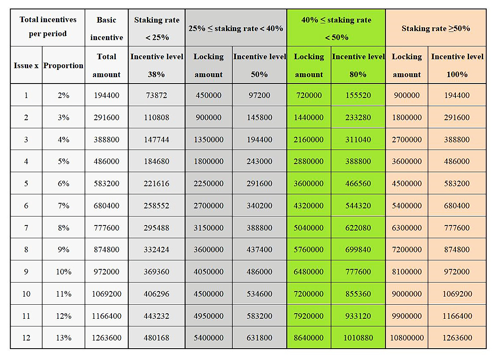

For example, if the total accumulated locking amount for both pools in period 3 is 2.2 million Meer, and the total accumulated theoretical production by period 3 will be 5.4 million Meer, then the staking rate is 40.74%, which has reached the expected threshold but not the ultimate threshold, so the total basic incentive available for this period is 388800 × 80% = 311,040 meer, and each of pool A and B will receive 155,520 meer.

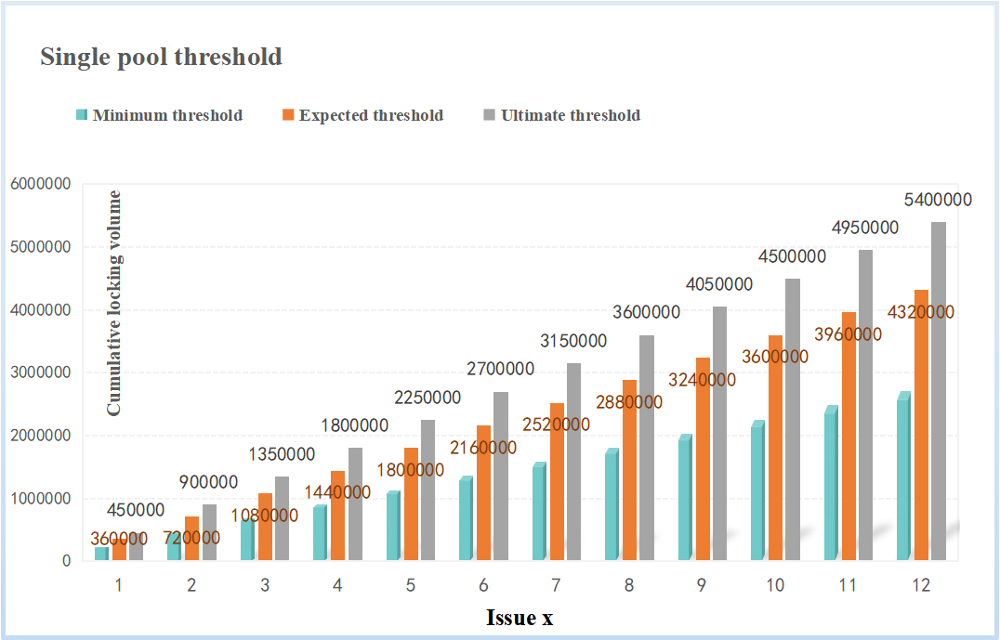

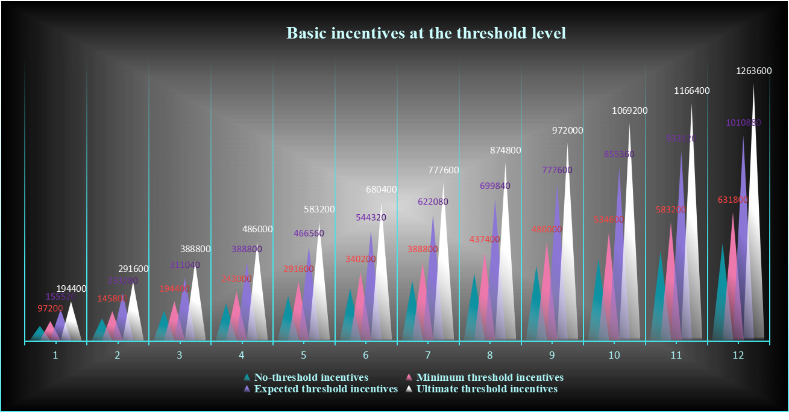

Poll A and B will compete for the winner according to the newly added locking volume in each period, and the winner will get the competition incentive in the current period. If the newly added locking volume of pool A is larger than pool B in the current period and the difference is higher than 10,000 meer, pool A will get the competitive incentive as the winner; if the newly added locking volume of pool B is larger than pool A in the current period and the difference is higher than 10,000 meer, pool B will get the competitive incentive as the winner; if the difference is less than 10,000 meer, there is no winner and the competitive incentive in the current period will be allocated to the eco-fund. The competitive incentive received by the wining locking pool will be allocated to the newly added locking funds of the current period in proportion to the amount of each locking funds in this pool.

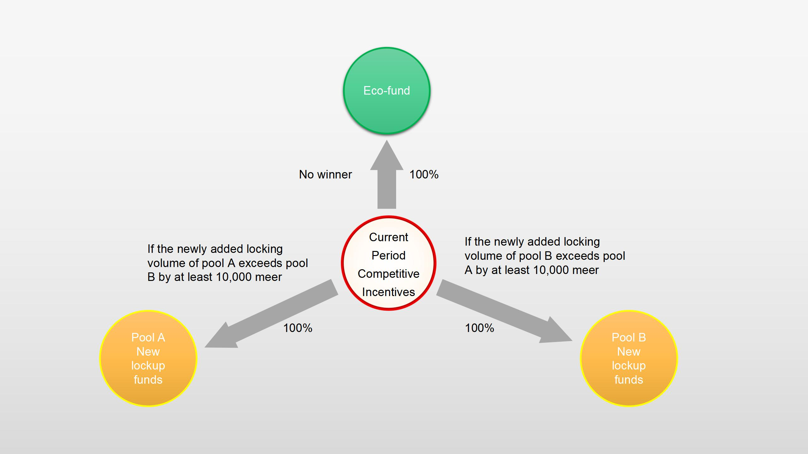

Since the base incentive for each period is allocated to all currently accumulated lock-up funds, the earlier the funds participate in the lock-up, the higher the accumulated incentive they will receive because they can enjoy the basic incentive for the later months. Since the competitive incentive is only allocated to the current winning pool and only to the new lock-up funds in the current period, the lock-up profit of the winning pool in the current period will be relatively higher if the difference in lock-up volume between the two pools is not very large.

By default, pool A is a staking pool for miners, while pool B is a locking pool for ordinary holders. For miners, they have a way to expand their income; for ordinary holders, they can gain the ability to resist inflation and earn a good profit.

The remaining 10% of the total available funds will be used for design and development, community operations, and ecological construction of the network.

### 4.4 Profit Calculation

All participants in the lockup may receive two parts of profit: the basic profit from the basic incentive pool and the additional profit from the competitive incentive pool. The basic profit are earned every period from the time of participation, while the additional profit are earned only in the period of participation and must be in the winning group of the current competitive incentive. This is shown in the chart below.

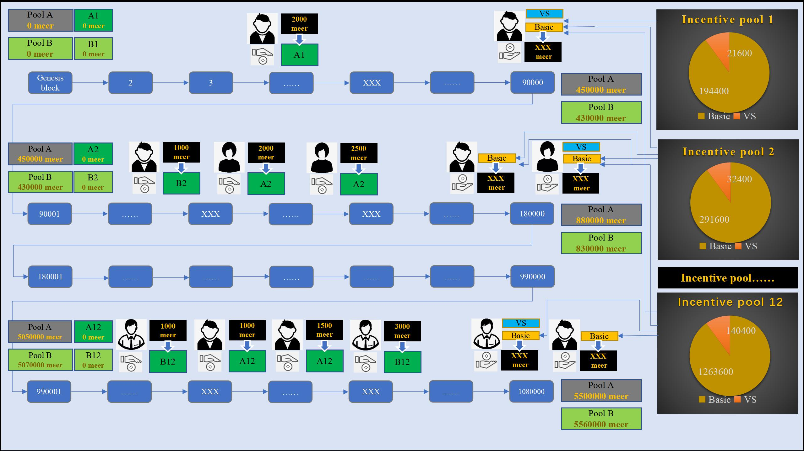

Assuming that there are n funds participating in a certain lockup pool at the current main height, the i-th fund joining the lockup is denoted as Li, L is its lockup amount, the main height at the time of joining the lockup is denoted as ti, and the lockup pool joining is denoted as "pool", pool is A or B. Assuming that the fund is joining the lockup in the x-th period, the fund can be denoted as (Li,ti,pool,x), i∈[1, n]. Since every 90,000 main heights is a lockup period, thus x = [ti/90000]+1 ("[]" is a downward rounding operation), the funds participating in the last block in each period will be counted in the next period.

Assume that the starting block of period x is Tx,start, and the ending block is Tx,end, then Tx,start = 90000(x-1), Tx,end = 90000x. Thus for all new lockups in period x, must satisfy 90000(x-1)≤ti＜90000x.

#### 4.4.1 Basic Profit

Since the time of participation in lock-up varies from user to user, we add effective locking time as the measure of basic profit calculation for the sake of fairness of profit calculation and to protect the interests of users who participated in early period. Each period is divided into 90,000 main heights, and if the locking time is calculated exactly according to the block, the difference between the front and back is too large, so we use the locking time weight to calculate the profit. The locking time weight of each 18,000 main heights is recorded as 1, so each period can get 5 locking time weights.

The **effective locking time weight** of any fund (Li,ti) in a single lock-up pool in period x is

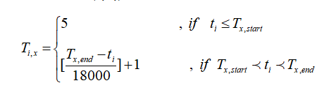

Note that funds participating in the lock-up prior to period x have an effective locking time weight of 5 in period x. Funds participating in the lock-up in period x have an effective locking time weight of 5 in all subsequent periods.

Assuming that the total basic incentive available in period x is Cx,basic. If a total of n locking funds have accumulated in a single lock-up pool in period x, the basic profit available to any of these funds (Li,ti) in period x is

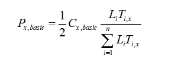

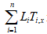 is the sum of the amounts of the n locking funds in that locking pool and their effective locking time weights. For ease of description, we call this the **locking volume**; refer to LiTi,x as the **fund weight** of that fund; and refer to the ratio of the fund weight to the locking volume as the **profit weight** of that fund. Since increasing locking funds leads to an increase in locking volume, the profit weight of a fund in period x will change with the locking volume.

Since the basic profit will be liquidated once in each period, the total possible basic profit for a fund is

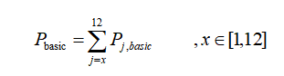

#### 4.4.2 Additional Profit

The competition incentive, as an additional profit, is not available to all locking funds. It is obtained with a certain gamble, and is only available to the lock-up pool that wins the competition in the current period, and is only allocated to the new lock-ups in the current period. For all new lock-ups in period x, they must satisfy 90000(x-1)≤ti＜90000x.

Suppose the total competitive incentive in period x is Cx,vs.

For the i-th additional locking fund in pool A, (Li,ti,A,x), the additional profit available in period x is

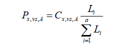

For the i-th additional locking fund in pool B, (Li,ti,B,x), the additional profit available in period x is

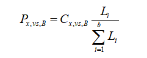

where a and b are the total number of new locking funds in period x for pool A and B, respectively. If the current competitive incentive winner is pool A, then Cx,vs,A = Cx,vs, Cx,vs,B = 0. If the current competitive incentive winner is pool B, then Cx,vs,A = 0, Cx,vs,B = Cx,vs.

A user who participates in staking lock-up may inject funds into different pools at different times. Therefore, the user's total profit will be calculated and summed according to the status of each locked fund.

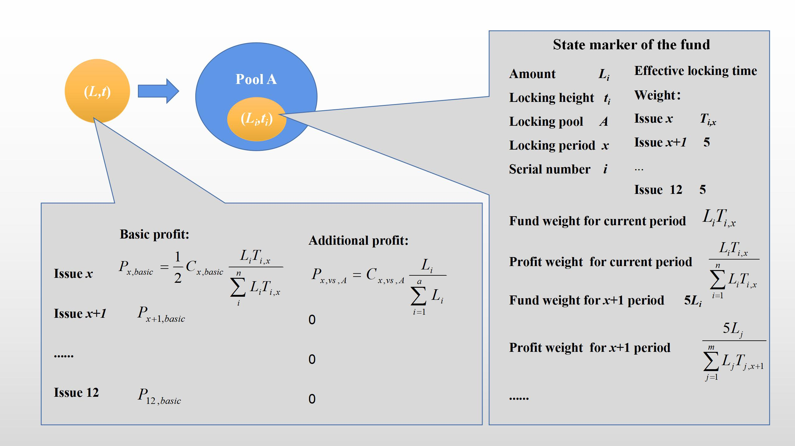

The above figure simulates the state marker and available profit of a sum of fund L after it is added to the locking pool A at the main height t.

### 4.5 Effective Time of the Game

The valid period of the game is set from the Genesis of Qitmeer Umayyad Network until the critical block, and the game lasts about one year.

