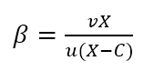
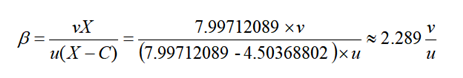
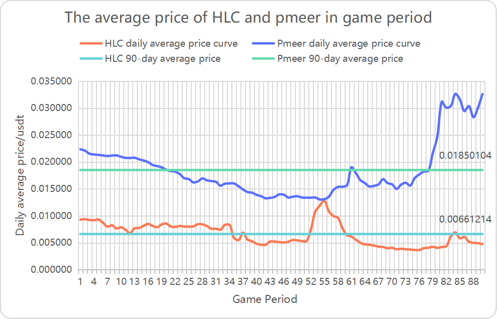
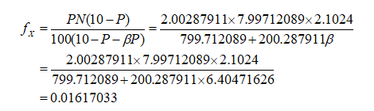
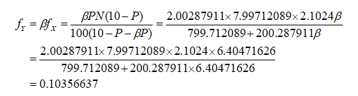

title: Economics of Qitmeer Umayyad Network  
Status: v1.01

# Economics of Qitmeer Umayyad Network

## Preface

Qitmeer Network is committed to building a fair system that serves global Inclusion Financial and Ethical Finance, so as to realize the financial values of neutrality and universality and the blockchain spirit of equality and openness. In the process of its development, it will go through the awakening and enlightenment in the Mecca era, the innovation and exploration in the Medina era, and then to the maturity and stability in the Umayyad era, and finally to establish a prosperous Abbasid era.

The development needs of each period are different and unpredictable, so it is difficult to fully plan in advance. we need to make adjustments in stages by combining the needs and status quo of different periods.The Umayyad era is the period when the main network of Qitmeer is officially launched and the result of the integration of the two value carriers, HLC and Pmeer, into one, symbolizing the maturity and stability of the soul and mind of the Qitmeer Network. During this period, the infrastructure construction will be gradually completed, the establishment of rules and regulations will be started, and the upper ecological construction will be greatly expanded, laying the foundation for the prosperity of the Abbasid era.

## 1. Qitmeer Base Token Amount

The native token of the Qitmeer main network is named Meer, and the smallest unit is Qit, 1 Meer = 100000000 Qit. In Umayyad era, the base token amount of the Qitmeer main network is set at 210240000 Meer, i.e. N = 210.24 million Meer.

## 2. Total Genesis Token Amount

When qitmeer enters the Umayyad era, it means that the network is  is maturing and stabilizing, but this is completely due to the foundation laid during the Mecca and Medina era. The value of these two periods can not be ignored. Therefore, when Umayyad Network is launched, we need to first create a part of Meer to inherit the value transferred from Mecca and Medina era.

Both Mecca-era tokens (HLC) and Medina-era tokens (Pmeer) will be converted into main network tokens (meer) at a certain ratio. According to the rules of Qitmeer Medina Network Economic-model, the proportion of the whole Medina Network in Qitmeer Network is 20.0287911%, which is a value obtained by democratic decision-making in the early stage of Medina Network. That is to, at the time of the genesis of Umayyad, 20.0287911% of Meer needs to be created for the HLC and Pmeer mapping. That is, the total amount of Meer used to map HLC and Pmeer is: N0 = 20.0287911% × 210240000 = 42108530.40864 Meer.

In addition, 3% Meer will be created at the same time as an incentive for the Founding team. Therefore, the total number of Meer genesis in Qitmeer Network during Umayyad is: Ng = N0 + 3%N = 48415730.40864 Meer.

Since there are many dust accounts which have been abandoned in HLC and Pmeer, there is no need to do mapping, so the actual total amount of Qitmeer Genesis will be rounded to 48415730 Meer.

### 2.1. Mapping ratio of burnt HLC(B-HLC)

In the development history of Qitmeer, the Medina era is an important transition from the spiritual awakening of blockchain to the gradual maturity of Qitmeer, and an important process for Qitmeer to become a public chain with independent standards. The burning of HLC token is an important symbol and preparation for the opening of Medina Network, which is also the first major democratic decision made by users of Qitmeer Network. It determines the upper limit of the total output available for PoW mining on Medina Network and the proportion of the whole Medina Network in Qitmeer Network.

In this burning event, HLC token holders have burnt a total of 200287911 HLC tokens, accounting for 20.0287911%. Therefore, according to the Economic Model of the Medina Network, the burnt HLC (B-HLC) can be prioritized to determine the mapping ratio, and 20.0287911% of the total amount of Mapping Genesis will be prioritized to allocate to make conversion for the burnt HLC, so as to compensate for their contribution to the Medina Network by actively giving up their liquidity.

Therefore, the total mapping amount of these 200287911 B-HLCs in the Umayyad Network is 20.0287911% N0, which is about 8433829.59082648 Meer. Correspondingly, the mapping ratio of a single token is fP = 0.04210853, i.e., one B-HLC can swap 0.04210853 Meer.

### 2.2. Non-equal weight mapping for HLC and pmeer -- the game parameters β of the two tokens 

In the Medina period, due to historical reasons, there are two tokens in Qitmeer Network: HLC and Pmeer, which are value carriers of different periods and will eventually be mapped into Meer in Umayyad era after a competition game of the two tokens in Medina era. Because of the difference of their characteristics, the value of individual Token is not the same, so HLC and Pmeer are non-equivalent mapping.

After 20.0287911% of the total Genesis token for mapping is preferentially allocated to B-HLC (burnt HLC), the remaining 79.9712089% is used to map HLC and Pmeer. Since they are non-equivalent mappings, they do not share the 79.9712089% equally, but play a competition game by free market to determine the size of their respective shares. Intuitively, the mapping ratios of individual Token are different, and the mapping ratios of these two Tokens will be affected by the game parameter β, and their mapping ratios will be equal only when β is equal to one.

The parameter β is a custom parameter. In the Economic-model of Medina Network, we define the parameters β is the ratio of mapping weights of a single Pmeer to a single HLC. That is, the mapping weight of one Pmeer is equivalent to β HLCs, i.e., 1 Pmeer = β HLC, a value that visually reflects the value inequality between the two.

In this free game between HLC and Pmeer, the number of participating Pmeer is 200287911 and the number of HLC is 349343287 (the total number of remaining HLC is 799712089, of which 450368802 HLC is locked and not in circulation). Their market shares ultimately determine their respective mapping weights, and the value of the parameter β will intuitively reflect this.

The value of the parameter β will be obtained according to the following formula:

where u and v are the market prices of HLC and Pmeer, respectively; X is the total amount of unburned HLC, i.e., 799.712089 million; C is the total amount of locked HLC, i.e., 450.368802 million. Therefore

Since the market state at any single moment is not representative of the overall level of the HLC and Pmeer games, we need to average the market data from one game stage to determine the value of β. First, we will determine the average price of HLC and Pmeer based on their daily opening price and closing price. Then, we will determine the final value of β by taking the average of the prices over the statistical period of the game data.

We calculated the data for 90 days of the game period and came up with the final results: the average price of HLC is about 0.00661214 USDT, the average price of Pmeer is about 0.01850104 USDT, and the final value of β is 6.40471626.

### 2.3. Mapping ratio of HLC(unburned) and Pmeer

HLC and Pmeer, as value carriers in Mecca era and Medina era respectively, coexist in Medina era and there is a free competitive game between them and they will be mapped into Umayyad Network simultaneously at the end of Medina era. Since they are different value carriers, they cannot be treated as equivalent, and in the allocation of the mapping, they will determine the weights of the allocation through a free market game.

Based on the principle that the total number of the Tokens is constant in Qitmeer Medina Network, the maximum amount of Pmeer output of Medina Network is determined by the total amount of HLC burned. Before the Medina Network was launched, a total of 200.287911 million HLCs were burned, so the total amount of Pmeer is 200.287911 million, while the total amount of remaining unburned HLCs is 799.712089 million.

After 20.0287911% of the total number of Mapping Genesis is preferentially allocated to  B-HLC(burned HLC) for mapping, the remaining 79.9712089% will be used for the mapping of HLC and Pmeer, i.e. the total conversion number of both to Meer is 79.9712089% N0 = 33674700.8178135 Meer. The mapping ratio of the two will be finalized with the determination of the game parameter β.

The calculation formula of HLC mapping ratio fX is as follows:

i.e., one HLC can swap 0.01617033 Meer. Where P is the total amount of HLC burned and N is the total amount of base currency in the Qitmeer main network.

The calculation formula of Pmeer mapping ratio fY is as follows:

i.e., one Pmeer can swap 0.10356637 Meer.

## 3. Block Reward 

### 3.1. The economic implications of block rewards

Choosing a block reward schedule is an important question that is often addressed heuristically. A key property of block rewards is that they add to the total token supply. Some cryptocurrencies (e.g., Bitcoin and derivatives) offer a block reward that decreases over time according to a fixed schedule, with a pre-determined end date.The total supply of Bitcoin tokens is thus limited. Others (e.g., Monroe) always maintain a block reward rate greater than zero; thus the supply of tokens is unlimited. As for how to evaluate these two modes of operation, in practice, there are always trade-offs from different perspectives.

Another important property of block rewards is that the burden of operating capital for the network is spread over a wide range of users to all those who hold tokens as a store of value or for speculative purposes. Growth in total token supply imposes a cost on all token balances, since purchasing power of tokens is eroded over time. This is similar to the concept of an "inflation tax" that is well known in traditional economic systems. Those who contribute resources to the network to maintain network operation and ledger security will be the beneficiaries of these "taxes", and they will receive newly minted tokens in the form of block rewards. Therefore, how these beneficiaries are defined is of great importance to the expansion and long-term development of the network.

In the development of the Internet, there is a famous Metcalfe's Law, which is to the effect that the more users there are in a network, the greater the value of the whole network and the nodes within that network; attracting more people to join creates a positive feedback, and eventually the value of the network will grow geometrically. At the same time, this process also makes the network's usage fee decreasing. This law essentially reveals the trend and rate of increase in the value of the network or technology. The most basic variable is the number of nodes in the network, which determines the use of the network. Similarly, in a blockchain network, the more users there are, the larger the network, the stronger the consensus, and the greater the value of that blockchain network. In short, the value of a blockchain network is proportional to the square of the number of nodes in its network.

In a blockchain network, the most important and fundamental node is the full node that runs a complete blockchain ledger. Full nodes are always synchronized with all blockchain data, can independently verify all transactions on the blockchain and update data in real time, and are responsible for broadcasting and verifying blockchain transactions in the blockchain decentralized ledger. The number of full nodes is directly related to the security of the network and the strength of consensus. In blockchains such as Bitcoin, miners are the primary full node runners. However, with mining becoming more and more centralized in pool mining, the individual miners do not run a full node anymore, and if a single group of miners remains the sole beneficiary of these "inflation taxes" (newly minted tokens allocated in the form of block rewards), it will not fully exploit the incentive of block rewards to maintain network security and stimulate network development, and will directly affect the scale of network development.

Bitcoin, the leader in the blockchain world, has been developing for ten years, and its hashrate of the whole network has grown almost exponentially in recent years, gaining wide recognition in the world, but the number of full nodes it currently has is only about 10,000 (https://bitnodes.io). Other blockchain networks have even fewer full nodes. One of the reasons for this is the concentration of hashrate in mining pools, where most miners no longer run full nodes, while miners are the only incentivized ones in the network. Another reason is that there is no economic incentive for full nodes to meet the growing demand of the network; it costs a certain amount of money to run a full node, and as the block data grows, the required storage space will become larger and larger, and the maintenance cost of full nodes will become higher and higher, which is not only unfriendly to building commercial applications on the blockchain, but also will inhibit the growth of the number of full nodes and even it will cause the loss of full nodes at a later stage.

If hashrate is the first layer of defense in a PoW network, then an ecological network of full nodes is the second layer of defense, and Qitmeer, a PoW network for Inclusive Finance, was designed with the idea that miners should not be the only beneficiaries of block rewards. There is no doubt that we need the hashrate provided by miners to ensure the security of the ledger, but we also need a large enough number of full nodes to improve the ease of use of the network and hopefully to incentivize more people to build an ecosystem on this network to scale it up. We believe that having a large enough base of full nodes is the foundation for breeding more ecosystems and businesses. Therefore, incentive for full nodes will be another important task for Qitmeer block rewards.

### 3.2. The target of incentives for Qitmeer block rewards: miners are not just the only beneficiaries

As the most important incentive in the development of blockchain networks, block rewards play a key role in sustaining network operations and maintaining the security of the ledger, affecting the scale and long-term stability of the network. In classic blockchain networks such as Bitcoin, miners are treated as the sole beneficiaries of block rewards, but with the emergence of mining pools, miners are more inclined to concentrate to the pools and give up solo mining, and therefore no longer establish a complete full node, which is far from the original vision of Bitcoin. Full nodes, however, are a natural requirement for decentralized networks, responsible for updating data in real time, broadcasting and verifying transactions, and keeping a complete copy of the blockchain ledger. The availability of a large and decentralized network of full nodes is fundamental to the blockchain's ability to achieve de-trust and is directly related to the security of the decentralized network and the trust and adoption of users.

In Qitmeer Network, we will face the same problem as Bitcoin, there is no way to avoid the centralization of hashrate, but how to make the network have a large and decentralized full node network is what we have to think about, which is not only the basis of a decentralized network, but also the need and guarantee of Qitmeer to support Inclusive Financial. Therefore, in the Qitmeer system design, miners will not only be the only beneficiaries of the block rewards, we will introduce a role for the network called "master node". In other words, we will provide economic incentives to full nodes to build a large and decentralized ecological network of full nodes.

Master nodes are a special class of nodes running full nodes that will promise real-time online services and guarantee loyalty to the network by staking a certain amount of assets, while they will receive rewards from the block.

Of course, the introduction of master nodes is not just about increasing the number of full nodes; master nodes are like a second layer of Qitmeer Network that can support instant micro-payment needs in Qitmeer's payment scenarios by running special protocols to provide users with InstantSend capabilities. This process is similar to the Lightning Network. InstantSend is of course an optional item. In addition to this, master nodes have an important function, which is to participate in the voting and decision making of the network. The master nodes will be the most important Decentralized Autonomous Organization in the Qitmeer Network and will be the decision makers in the development of the network by participating in voting on proposals for network improvements, each master node will have one vote for each proposal (agree/disagree/abstain).

Secondly, in order to encourage and support users to build the ecosystem on the Qitmeer Network, the network will set up a financial budget for ecological construction, which will be used to give back to the nodes that have made great contributions to the network ecological construction. We hope that more developers will adopt the Qitmeer Network to build an ecosystem, and the ecological construction budget will give them support and reward.

Therefore, the block reward of Qitmeer Network will be used in three places: the incentive for miners, the incentive for the master node, and the financial budget for ecological construction.

### 3.3. Qitmeer Block Reward Schedule 

The preceding analysis of the economic significance of block reward provides some guidance on how to design a more desirable block reward schedule. A well-chosen block reward schedule should ensure the long-term economic viability of the payment network, including sufficient incentives for users to adopt, participate in performing network functions, and expand the network ecosystem.

In the design of Qitmeer Block Reward Schedule, we use 50% of the block reward as an incentive for miners in return for providing hardware equipment to maintain the network, and secondly, the remaining 50% of the block reward is used as revenue for the staking of master nodes.

During the Umayyad era, the average block time of Qitmeer main network is set to 30 seconds, and the initial block reward for each block is set to 20 Meer. 10 Meer is used for the PoW miner incentive and 10 Meer for the master node incentive.

According to this setting, the initial daily issuance of Qitmeer is about 57,600 Meer, of which 28,800 Meer is directly allocated to miners and 28,800 Meer is released to the master node staking incentive pool. Since the MeerDAG protocol of Qitmeer supports concurrent blocks, the actual daily minting volume will be larger than 57,600 Meer, with an average concurrency of about 5%.

### 3.4 Master Node of Qitmeer

#### 3.4.1 Why become a master node of Qitmeer?

If we regard PoW consensus as the first layer of Qitmeer Network, then the MasterNodes of Qitmeer is the second layer built on top of the first layer network. The second layer network can provide additional services, such as InstantSend, which improves the efficiency of transactions, PrivateSend, which guarantees financial privacy, and Decentralized Autonomous Organizations (DAOs). The first layer of the network validates the newly generated blocks, provides power for the whole blockchain to move forward smoothly, and ensures that the network can provide basic functionality and security. The second layer, the MasterNode network, provides additional functionality to the whole blockchain, thus improving the ease of use and reliability of the system.

The Qitmeer Network sets rewards for master nodes for the services they provide to the network, 50% of Qitmeer's block reward will be allocated to reward the master nodes. Therefore, being a MasterNode of Qitmeer provides a certain amount of financial gain and enables the accumulation of more token assets, which can effectively resist the inflationary loss of token holdings.

Qitmeer master nodes use Meer tokens as a deposit to guarantee their loyalty, and in return, MasterNode holders will be regularly rewarded for the services provided by master nodes. According to the setting of block time of 30s and block reward of 20 Meer, at least 28800 Meer can be used for MasterNode reward every day. Assuming that there are 10000 master nodes, each node will have 2.88 Meer revenue every day.

Becoming a MasterNode of Qitmeer will be the most important and direct way for you to participate in the development and improvement of the network. The MasterNode will be the most important project management of the Qitmeer Network and will vote on the future development of Qitmeer, including the implementation of Qitmeer improvement proposals and the use of the ecological budget.

#### 3.4.2 how to be a master node of Qitmeer?

To become a MasterNode of Qitmeer, certain conditions need to be met.

1. A computer or server with acceptable performance is equipped with public IP. Of course, you can't shut down it often

   Since MasterNode needs to  provide services for the network, it needs to be always on-line, and off-line is not profitable. In addition, certain hardware configuration is also required, but it is not too demanding and an average home computer can do the job. To ensure that the MasterNode is always connected to the network, it is important to have a stable public IP. In fact, renting a VPS server to run masternode is the simplest.

2. A certain number of Meer tokens

   To run a MasterNode, you must hold a specified number of Meer tokens as proof of your loyalty to Qitmeer Network, and you need to deposit a certain number of tokens to a separate address, which will be locked when running the MasterNode.

3. Simple technical knowledge

   To run a MasterNode, you need to prepare a configuration file and write the necessary parameters in it. In addition, you need to have a little knowledge of Linux server operation, but this is only very simple computer basics.

#### 3.4.3 Qitmeer MasterNode Reward Schedule 

Becoming a MasterNode of Qitmeer by staking a certain amount of Meer margin, ensure stable online service for Qitmeer Network, and will receive block rewards periodically.

For every new block generated by Qitmeer Network, 50% of the block reward will be accumulated to the MasterNode reward pool, and Qitmeer's MasterNode system will pay out the reward periodically based on the effective online duration of MasterNodes.

Since the MasterNode system is not expected to be completed until a year after the Umayyad Network goes online, more details will be announced in the later version.

