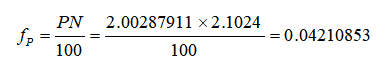

# Qitmeer Umayyad Network Mapping & Release Rules

## 1.Basic Parameters of Qitmeer Umayyad Network

- The economic model of the Qitmeer Network will be adjusted in stages according to the different periods of development of the network. In the Umayyad era, the base token amount of Qitmeer main network is 210240000Meer. 

- Total Genesis Token Amount: mapping Genesis 20.0287911%, 42108530.40864 Meer; team incentive 3%, 6307200 Meer; the total Genesis about 48415730 Meer.

- 50% of the block reward is used for PoW mining incentive, 50% for master node staking incentive.

  - The block time is 30 s/block, block reward R = 20 Meer/block

    Total daily production is about 57,600 Meer, of which 28,800 Meer is PoW incentive and 28,800 Meer is staking incentive. Total monthly production is about 1728000 Meer, total annual production is about 21024000 Meer.
    
  - Since master node function is not yet available in the first year, the master node incentives for the first year is not released directly, but is used as an Eco-fund for network development.
   
## 2.Qitmeer Umayyad Network Mapping Redemption Rules

Considering that there are some accounts in HLC and Pmeer networks with very small balances generated by testing, which have become abandoned accounts due to their very small balances, we call such accounts dust accounts. For the dust accounts, because their balance is too small, the balance after mapping is also basically negligible, and most of these accounts are abandoned, it is meaningless to do mapping for them, which will only consume network resources for nothing. Therefore, instead of mapping the dust accounts, the dust balances will be grouped together in the network Eco-fund.

### 2.1. HLC dust account definition

- 1) There is a burning test address with an account balance of 9HLC.

- 2) HLC has done community activities before with a minimum reward amount of 50HLC, and there are many such airdrop accounts.

- 3) Currently, HLC has 1913 holding addresses on-chain, of which the balance of the latter 913 addresses are less than or equal to 50HLC. Among all the holding addresses, there are 679 addresses whose balance is equal to 50hlc, and 38 addresses whose balance is greater than or equal to 5 but less than 50hlc; There are 3 addresses whose balance is equal to 5 and 224 addresses whose balance is less than 5; 210 addresses with balance less than or equal to 1 (Data source: 
   https://www.oklink.com/eth/token/0x58c69ed6cd6887c0225d1fccecc055127843c69b).
   
  Since there are a total of 224 addresses with address balance less than 5 HLC, but there are 210 addresses with balance less than or equal to 1. The swapping amount of 5 HLC after mapping is also about 0.1 Meer. therefore, we propose to define the HLC accounts with account balance less than 5 as dust accounts, i.e., HLC dust account is HLC < 5.

### 2.2. Pmeer dust account definition

There are many Pmeer accounts with very small balances. Out of a total of 3500 addresses, there are 1696 addresses with balance less than 1 Pmeer. Among them, there are 380 addresses with balance greater than or equal to 0.1 and less than 1 Pmeer; 1318 addresses with balance less than 0.1 Pmeer; 1044 addresses with balance less than 0.01 Pmeer, and 652 addresses with balance greater than or equal to 0.01 and less than 1 Pmeer. (Data source: https://explorer.qitmeer.io/)

Among the 1,696 accounts with address balance less than 1Pmeer, there are some accounts with balance of 0.1 or 0.0999, which are mining addresses that have participated in mining pool mining, but have not continued mining due to too little hashrate, and there is only one transaction from miner in the account. These accounts are likely to become abandoned accounts as well. In addition, there are many accounts with even smaller balances, most of which were generated for testing purposes and have become abandoned accounts. Even if these accounts are mapped, most of them will have a balance of less than 0.01 after mapping.

**In short, addresses with account balances less than 5 HLC or less than 1 pmeer will be defined as dust accounts and will not be mapped. The dust balance will be grouped into the network Eco-fund.**
   
### 2.3.The mapping ratio of HLC and Pmeer

Qitmeer Umayyad Network needs a Genesis amount of 42108530.40864 Meer (20.0287911%) for HLC and Pmeer mapping. At the same time, 3% Meer needs to be created as an incentive for the Founding team, i.e. 6307200 Meer. Therefore, the total number of Meer genesis in Qitmeer Network during Umayyad is: Ngenesis = 42108530.40864 + 6307200 = 48415730.40864 meer, which is about 23% of the network.

Considering that the dust account will be not mapped, the total amount of Genesis will be rounded to 48415730 meer.

Calculation of the mapping ratio:

- Mapping ratio of burnt HLC(B-HLC)

  A total of 200287911 HLC have been burnt, and 20.0287911% of the mapping Genesis amount will be used for B-HLC mapping. The corresponding mapping ratio of individual Token is: 
  
  
  
  This means that one B-HLC can swap 0.04210853 Meer. The total amount of B-HLC can swap 8433829.50898083 Meer in total.
  
- Mapping ratio of unburned HLC

  
  
  i.e., one HLC can swap 0.01617033 Meer.
  
- Mapping ratio of Pmeer

  
  
  i.e., one Pmeer can swap 0.10356637 Meer.
  
Since there is a competitive game relationship between the unburned HLC and Pmeer, the value of β represents the final result of the game, β = 6.40471626.

## 3.Linear Release Rule for the Genesis Balances of Qitmeer Umayyad Network 

At the initial stage of Umayyad Network launch, a one-time Genesis will generate approximately 23% of Meer, which will be used primarily for mapping redemption to Medina network users and Founding team incentives. Considering the stability of Umayyad Network,in order to mitigate the one-time impact of this 23% Genesis balance on the market, we will take linear release for these Genesis balances. The maximum amount of linear release is 48415730 Meer.

First of all, due to the high number of releases in linear release, from the perspective of cost control, small Meer address with small balances will not be involved in linear release and will be released in a one-time manner. **For accounts with Meer ≤ 1000, we define them as small accounts, small accounts do not participate in linear release**.

Secondly, for all accounts requiring linear release, the release rate will remain at a total daily release of 28,800 Meer, which is similar to the total daily production of PoW, and the annual release amount is approximately 21.71% of the total Genesis.Individual address will be released linearly on a pro-rata basis every day with such a release cycle.

At a later stage, depending on the actual status of Umayyad Network development, further adjustments to the linear release rules will not be ruled out in order to increase the release rate.

