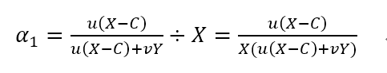
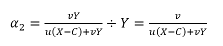
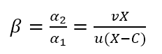

title: Qitmeer 测试网经济模型   
description: 销毁HLC，挖出pmeer     
Status: v1.09

# Qitmeer 测试网经济模型   

## 摘要

Qitmeer Network 是一条基于 PoW 共识算法的 BlockDAG 网络，是融合经典 UTXO 模型和前沿 DAG 技术的一次探索。Qitmeer 的 BlockDAG 是一个基于 SPECTRE 协议的协作模型，在挖矿中，这种协作模型在安全性、开放性、公平性和可扩展性之间实现了经典区块链度量的理想平衡。

Qitmeer 是一个开放的区块链网络，Qitmeer 共识符合经典区块链设定：开放，公平，安全，可扩展性。通过工作量证明机制，可以自由进出网络。BlockDAG 的协作模型使得独立挖矿和矿池挖矿具有相同的机会成本。同时，Qitmeer采用了抗ASIC 挖矿算法防止算力集中。

Qitmeer 测试网将引入真实矿工进行测试，以确保网络的逐步成熟与稳定。这是一个向 Qitmeer 主网逐步过渡的阶段。而测试网的经济模型既要解决过渡阶段的激励问题，又要解决转型后的历史问题。

## 介绍

### 名词定义

- HalalChain ERC20 代币：HLC
- Qitmeer 测试网代币：pmeer
- Qitmeer 主网本币：Meer

### 背景

Qitmeer Network 是由 HalalChain 转型发展而来的一条公有链。HalalChain 最初的设想是利用联盟链实现商业应用，在实现的过程中最终决定转型建立底层公有链。Qitmeer 是对经典区块链的一次创新与探索，是区块链从链式结构向图式结构的一次迈进。

Qitmeer 测试网是一个向主网的过渡阶段。一方面，在此期间，我们将引入真实的矿工算力对 Qitmeer 网络进行测试；另一方面，我们将完成HLC token（以及测试网）向主网的过渡与映射。

Qitmeer 测试网经济模型是一个向 Qitmeer 主网的过渡模型。在测试网之间，矿工每挖出一个 pmeer，需对应销毁一个HLC，pmeer 数量和 HLC 数量总和保持在 10 亿。pmeer 的可挖量将和 HLC token 的销毁量直接关联。在测试网结束时，建立 HLC --> meer 和 pmeer --> meer 的双通道映射。

### HLC 目前的结构

HLC代币已通过ICO进行了分配，主要包括以下部分：ICO出售的市场部分、发展基金和开发团队奖励。

- 市场部分：属于已确认所有权的个人资产，假设为A。

- 发展基金：用于生态发展的公共资产，假设为B。

- 团队奖励：属于尚未分配的个人资产，假设为C。

A、B和C的确切数字将由HLC基金会公布，A+B+C＝10亿。

## 模型设计

### 目标与规则

区块链的精神是权力充分下放，社区共同治理。Qitmeer 作为一条公链，在其经济模型的设计中，我们将遵循这一精神。因此，Qitmeer 测试网经济模型将是一个社区共同博弈的模型，而不是一个由某基金会主导的模型。

该模型设计的核心思想，一方面是要吸引真实矿工算力对 Qitmeer 网络进行测试，另一方面将根据销毁的 HLC token数量决定整体在 Qitmeer 主网的映射占比。最终结果由各方自由博弈而得，整个过程遵循以下规则：

 - **销毁与产出**：每销毁一个HLC，相应地才可以产生出一个pmeer，销毁过程公开；
 
 - **总量恒定**：pmeer 和 HLC 的总量保持在10亿，pmeer数量 + HLC数量 = 10亿；
 
 - **兑换自由**：pmeer 持有者和 HLC 持有者在双方自愿的情况下自由交换；
 
 - **映射优先权**：参与销毁的 HLC 将按照其网络比重获得映射的优先选择权。
 

### p-meer总量定义

我们秉持总量恒定原则，价值不会无中生有的产生，也不会无缘无故的消失。pmeer 可产出上限将由销毁的 HLC token 数量决定。意味着 pmeer 的实际产量将小于或等于销毁的 HLC 数量。

- 假定在某一时刻市场中 HLC token 的总数量为 X亿，pmeer的总数量为 Y亿，则 X+Y=10。

- 假定参与销毁的 HLC token数量为 P 亿，则代表 pmeer 的可产出总量为 P 亿。意味着 Y ≤ P。

### HLC token的销毁

由于 pmeer 的可产出总量将由参与销毁的 HLC 数量决定，我们将建立 HLC token 销毁池，所有的 HLC 持币用户均可参与销毁，所有在测试网期间参与销毁的 HLC token 都将直接获得主网映射资格，并且可以获得在映射时的优先选择权以及其他优惠权益。

为了保证所有参与HLC销毁的用户能获得相应权益，每一个参与销毁HLC的用户都将获得一份销毁证明，可以凭借该凭证参与主网映射以及获取其他优惠权益。

为了描述方便，我们将销毁的 HLC token 用 B-HLC 代替表示。

销毁是自由的，同时也是一个自我博弈和多方博弈的过程。最终销毁的 HLC token 数量将决定以下三个参数的取值：

1. 测试网在整个主网中所占的比例
2. 测试网络的挖矿周期
3. B-HLC 和主网映射时所占的权重比例 

假如销毁了2亿 HLC token，则
1. 测试网在整个主网的占比是 20%；
2. 测试网的挖矿周期约为 17.8 个月（按出块时间120s，区块奖励520计算，即挖矿周期 T=200000000÷520×120÷3600÷24÷30=17.8月）；
3. B-HLC和主网映时的权重占比为 20%，剩余 80% 用于给 HLC token 和 pmeer持有者映射，其映射比和关系将通过下文的博弈设计体现。

### HLC token 和 p-meer 的价值不对等性

pmeer 持有者和 HLC 持有者可在双方自愿的情况下自由交换，但对于 Qitmeer 网络而言，一个 HLC token 和一个 p-meer 的价值是不对等的，这种价值不对等性将体现在单个 token 分配权重的不同。在同主网映射时，我们将根据二者的流通市值比例确定其分配权重。

在 HLC 的分配结构中，我们知道发展基金部分和剩余的团队奖励部分是由 HLC 基金会管理的，这两部分（具体数量将由基金会给出，这里姑且假定为C，**C为常数**）将做锁仓处理，不会进入流通市场，同时不参与销毁。即，将有 C 亿的 HLC token 由基金会对其进行锁仓。

假设 **HLC token 的市场价格为 u，pmeer 的市场价格为 v**，则：

- HLC 的流通市值为：u(X-C)
- pmeer 的流通市值为：vY

二者的总市值为 (u(X-C) + vY)，其中，HLC 占比 u(X-C)/(u(X-C)+vY)，pmeer 占比 vY/(u(X-C)+vY)。  

那么他们的分配权重将是：

- HLC 的整体分配权重：u(X-C)/(u(X-C) + vY) 
- pmeer 的整体分配权重： vY/(u(X-C) + vY) 

对应到单个 token 的权重是：

- 单个 HLC 的分配权重：α1 = \[u(X-C)/(u(X-C) + vY)] ÷ X = u(X-C) / X(u(X-C) + vY)

  
  
- 单个 pmeer 的分配权重：α2 = \[vY / (u(X-C) + vY)] ÷ Y = v / (u(X-C) + vY)

  

我们定义 **_β_ = α2 / α1** ，那么 _β_ 则体现了二者的价值不对等，直观体现就是映射权重的不同。1 个 pmeer 的映射权重相当于是 _β_ 个 HLC，即 **1 pmeer = _β_ HLC** 。代入 α1 和 α2，化简后可得

 
由于 HLC token 和 pmeer 的价格是动态的，以某一天的价格作为计算依据是不恰当的。因此，我们将在测试网期间统计 u 和 v 的**每日均价**，然后求其平均值，以此平均值作为计算依据。统计周期为测试网开始到测试网结束。

每日均价 vi = （每日开盘价 + 每日收盘价 ）/ 2 ，

u = (u1 + u2 + ⋯ + ui) / i ，

v = (v1 + v2 + ⋯ + vi) / i 。

### 映射规则

- 确定在主网的占比（w）

  假设最终在映射时 HLC、pmeer 和 B-HLC 整体对应的主网币（设为 N0 亿）占主网总量（设为 N 亿）的比例为 w，则 **w·N = N0**。
  
  B-HLC 的数量确定了 pmeer 的可产出数量，牺牲了流通性，而 HLC 和 pmeer 拥有在市场获利的可能，w 的取值由销毁的HLC（B-HLC）数量决定，即 w = P/10，
       
  

- 映射比（f）的确定

  定义映射比 f：单个token映射时获得 meer 的数量，即 1 token = f meer。
  
  HLC、pmeer 和 B-HLC 整体在主网的占比是 w，对应的 meer 数量是 N0, 销毁的 P 亿 HLC 将优先占有 P/10 的份额，剩余的（1 - P/10）的份额由 HLC 和 pmeer 共同分配。
  
  **B-HLC 的映射比（fP）**：
  
  
  
  **HLC 的映射比（fX）和 pmeer 的映射比（fY）**：
  
  由于 1 pmeer = _β_ HLC，则 Y pmeer = _β_ Y HLC。假设 HLC token 的映射比为 fX ，pmeer的映射比为 fY ，则 fY = _β_ fX。因此：
  
  
  
  由于 X = 10 - P，故
  
   

  鉴于总量恒定原则，**Y 的最终取值以 pmeer 的最大可产出总量为计算标准，即 Y = P**。因此，最终映射比的确定主要取决于 P 值。即：

  

   而
    
   

### 参数设定

- **出块时间 t**：出块时间是单个区块产生的时间间隔。这将是一个综合考虑的结果。

  在 PoW 中，这个值是统计意义上的，实际情况是时大时小，在比特币中这个统计期望是10分钟。该值的确定需要考虑到区块广播延迟，既要保证交易确认的安全性，又要减少分叉率。当前的互联网环境，大致需要 10 秒可以广播到 90% 以上的节点。同时，该值也指导着难度调整方向。当真实出块时间（一段时间的平均值）小于 t 时，难度将会增加；否则，难度将调低。

  Qitmeer 采用了 SPECTRE 与 GHOSTDAG 的混合共识，实现了快速确认和高吞吐量。相较于比特币，出块时间得到了显著缩减，吞吐量也得到了明显提高。在 Qitmeer 测试网中，出块时间暂定为 120s。

- **区块奖励 r**：区块奖励是代币池的增长率，代表了矿工可以从单个区块中获得的代币奖励数量，是核心利益所在。

  表面上，区块奖励的性质是增加代币供应量。但更重要的是，它确保了网络的长期经济可行性，为用户的采用和矿工的参与提供了充分的激励。在一个新系统中，网络功能的运转资金主要依靠区块奖励。

  Qitmeer 测试网期间的区块奖励设定，与计划发放的货币量及计划持续时间有关。考虑到挖矿成本及货币供应速率等综合因素，经过综合权衡，Qitmeer 测试网期间的区块奖励定为每个块 520 pmeer。

  在出块时间为 120s、出块奖励 r = 520的情况下，一年时间约可产出币量 520×365×24×3600÷120=1.36656亿，每一天产币量约为 520×24×3600÷120 = 37.44万。
  
  值得一提的是，由于 Qitmeer 的 BlockDAG 模型是一个合作模型，区块奖励可能不再是某一个矿工独享，区块奖励会根据是否在主链上而进行梯度发放。

- 挖矿难度：PoW 挖矿的过程实际上是随机的 hash 碰撞过程，寻找一个小于目标hash值的解。而找到满足条件的解的概率就是挖矿难度。该难度值会随着算力的变化按照一定规则自动调节，以保证出块时间的稳定。

  测试网挖矿初始难度以普通电脑可以参与为基准，随着算力的增加自动调节。

#### 特别说明

在 Qitmeer 中所使用的 SPECTRE 协议是一个可以快速确认的 BlockDAG 协议，甚至可以达到秒级确认，前文所定的 120s 的出块时间是相对保守的。在 Qitmeer 的测试网期间，为了探索 BlockDAG 网络的性能极限，不排除会做一些条件参数上的变更，这其中就有可能会有出块时间的调整。为了保持货币供应速率的稳定，如果对出块时间做了调整，相应地也会调整区块奖励，以确保每日货币供应总量的恒定。

下表将给出出块时间可能的调整目标，以及对应的区块奖励：

| 出块时间 t | 区块奖励 r |
| --------- | ---------- |
| 120s | 520 |
| 60s  | 260 |
| 30s  | 130 |
| 15s  | 65  |
   
### 测试网终止条件

随着 Qitmeer 测试网运行的逐渐稳定，当满足以下某一条件时，将终止测试网运行，启动 Qitmeer 主网运行。

- 时间指标：测试网计划运行时间最长不超过18个月，对应区块高度约为388800。鉴于销毁了多少，就应该挖出多少的原则，此指标不排除根据实际情况进行调整。

- 总量指标：由于测试网期间的 pmeer 可产生总量由销毁的 HLC 数量（即 B-HLC 数量）决定，若 pmeer 实际产量提前达到了 B-HLC 数量上限，则触发终止条件。

- 主网开发进度：若 Qitmeer 主网开发顺利，网络及生态发展健康良好，长时间处于稳定状态，可以根据实际情况进行社区共识以终止测试网运行。
 

## Version History

- 2019/07/30  v1.0 : initial draft
- 2019/08/03  v1.01 : modify config
- 2019/08/16  v1.02 : update config
- 2019/08/21  v1.03 : update structure
- 2019/08/22  v1.04 : update config
- 2019/08/28  v1.05 : update config
- 2019/08/30  v1.06 : modify config
- 2019/09/07  v1.07 : update config
- 2019/09/07  v1.08 : update config
- 2019/09/24  v1.09 : update definition of β
- 2019/09/24  v1.09 : add note of block time adjustment
