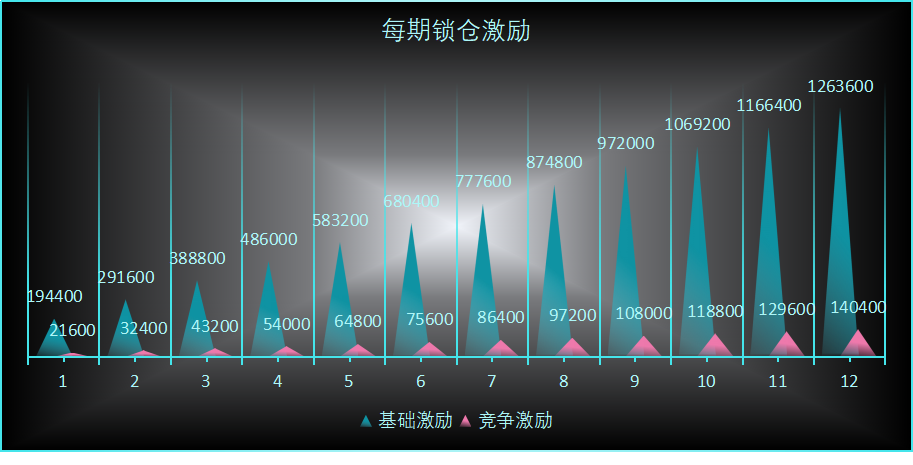
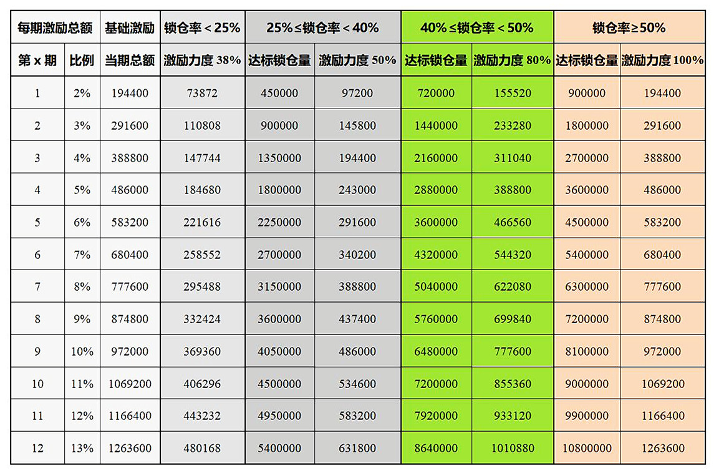
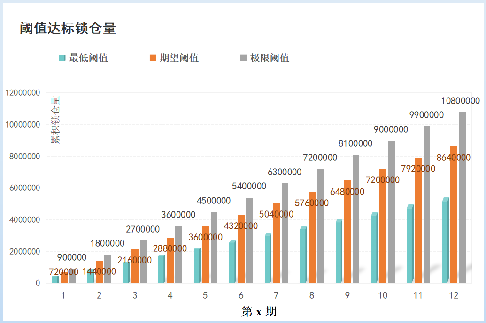
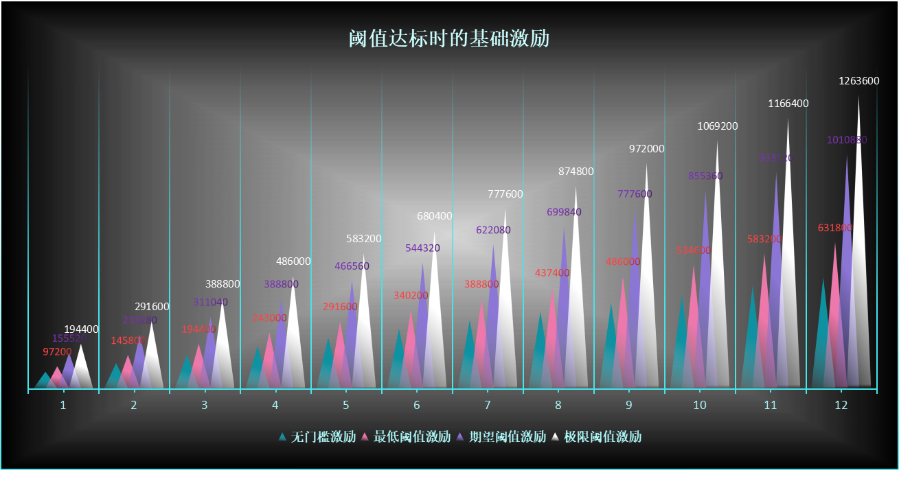
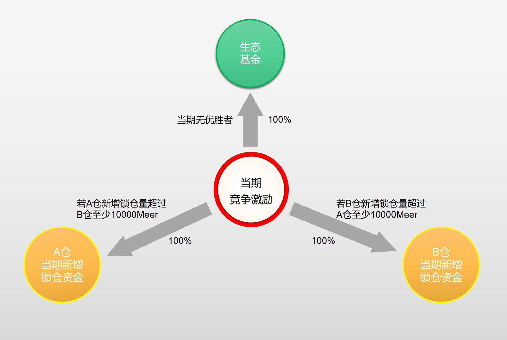
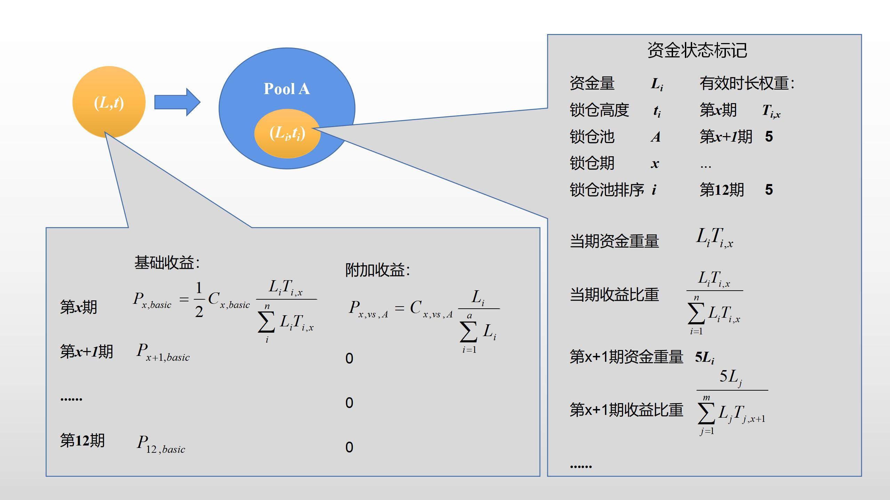

title: Qitmeer Umayyad Network 1.0 经济模型     
Authors：yatingzhou & blocklee & yujie, Qitmeer Economic Team     
Version: 1.71    
October 21, 2021    

# Qitmeer Umayyad Network 1.0 经济模型

## 前言

Qitmeer Network秉承着中正普世的金融价值观和平等开放的区块链精神，致力于形成一个面向全球普惠金融和伦理金融的系统。Qitmeer Network的发展历程分为四个时期，即 Mecca 时期的觉醒与启蒙，Medina 时期的创新与探索， Umayyad 时期的成熟与稳定，以及Abbasid 时代的繁荣。

Qitmeer Network的每个时期都会呈现出不同的发展需求，它无可预料，难以完全预先计划好，我们需要结合不同时期的需求和现状进行阶段性的调整。Umayyad 时期是 Qitmeer 主网正式上线的运行期，也是 HLC 和 Pmeer 两个价值载体融合归一的结果，象征着 Qitmeer 网络灵魂与思想的成熟与稳定，在这个时期，将逐渐完备基础设施建设，开始建章立制，大力拓展上层生态建设，为 Abbasid 时代的繁荣奠定基础。

下面将从Qitmeer Umayyad Network经济总论、Qitmeer Umayyad Network 1.0创世与映射规则、Qitmeer Umayyad Network释放规则、“多数者博弈模型”游戏设计等方面展开详述。

## 1. Qitmeer Umayyad Network 经济总论

### 1.1 Qitmeer Umayyad Network 基础代币总量

Qitmeer Umayyad Network的本币命名为 Meer（首字母大写），同时，meer（首字母小写）也是本币的通用计数单位，且本币的最小计数单位为 qit，1 meer = 100000000 qit。在 Umayyad 时期，Qitmeer Umayyad Network的基础代币总量（记为N）设定为 210240000 meer，即 N = 2.1024亿 meer。

Qitmeer Umayyad Network的本币可分为创世部分与新增部分。创世部分又可分为映射部分与团队激励部分。映射部分涉及一套算法规则，且包含对尘埃账户的定义与处理；同时，创世部分还涉及如何释放的问题；同时，针对Qitmeer Umayyad Network本币还设定了一种富于趣味的存储激励机制。下面分别进行详细阐释。

### 1.2 Qitmeer Umayyad Network 经济理念

Qitmeer Umayyad Network 1.0 阶段正处于基础设施建设时期，其供给大于需求。在这个阶段，矿工即是经济系统中的生产者，同时也要扮演着需求者。我们将建构一种自组织式的生产需求互馈机制。在历史上，类似的互馈机制曾经塑造过一些典型的经济系统，例如美国铁路网的自发式建设等。在当下需求不足时，生产者与消费者的身份可以重叠，其关键因子在于对未来的预期。当系统中的供给大于需求时，经济机制的设计就应该着眼在隐性需求上，即，预期如何能更好的作为需求？需求又如何反向促进供给的发展？在制度设计上，一种直接的方式即为经济上的宏观调控。

然而，对于一个去中心化的经济系统而言，宏观调控应该和“看不见的手”相融合，而非作为一种单纯的外部性而引入。微观经济学和宏观经济学的融合在一个具体的经济系统中也意味着一套富于想象力设计。我们将于第四点“多数者博弈模型”游戏设计中着重讨论。

传统经济学强调 “边际效用递减”的规律，然而自从阿尔弗雷德·马歇尔在 1890 年出版的《经济学原理》中提出与收益递增理论对应的叙述开始，经济学家觉察收益递增理论已超过100年，可事实上，主流经济学家对具有单一均衡解的模型情有独钟，这种偏好与“收益递增”这一思想存在冲突。

“收益递增”主要是由创新推动，其基本保障是要形成一种正向的循环，即所谓“正反馈”。正反馈是一个加速、放大、自我强化的循环，而负反馈则是一个降速、抑制、自我约束的循环。传统经济学假设经济过程由抑制性的负反馈主导。但是，真实的世界同样也展现了正反馈或收益递增的现象。例如，网络上可获取的信息越多，网站本身就越有用；买某只股票的人越多，就有越多的人争相追涨。

设计 Qitmeer Umayyad Network 1.0 的经济系统，引导主网演化，逐渐进入某种“正反馈”的循环中，使得对未来的预期从需求扮演逐渐变为生产扮演；并且，以某种激励机制为导引，从代币资源的分配自发演化为代币价值的生成与提炼。这个过程就是 Qitmeer Umayyad Network 1.0 发展的核心目标。

## 2. Qitmeer Umayyad Network 1.0 创世与映射规则 

Qitmeer Network 进入 Umayyad 时期，象征着网络正逐渐走向成熟稳定，这得益于 Mecca 时期和 Medina 时期所奠定的基础。因此，在 Umayyad 网络启动时，需要首先创世产生一部分 Meer 用于继承从 Mecca 时期和 Medina 时期转移而来的价值。

Mecca 时期的代币（HLC）和 Medina 时期的代币（Pmeer）都将按照一定的比例转换成为主网代币（Meer）。根据 Qitmeer Medina 网络经济模型的规则，整个Medina 网络在 Qitmeer Network 中所占的比例为 20.0287911%，这是一个 Medina 网络初期通过民主决策得来的数值。也就是说，在 Umayyad 创世时，需要先创世出 20.0287911% 的 Meer 用于给 HLC 和 Pmeer 映射。即，用于给 HLC 和 Pmeer 兑换的 Meer 总量，记为 N0，N0 = 20.0287911%×210240000 = 42108530.40864 meer。

此外，将同时创世出 4% 作为对创始团队的激励。

因此，Umayyad 时期，Qitmeer Network 的创世总量为：Ng = N0 + 4%N = 50518130.40864 Meer。

由于 HLC 和 Pmeer 存在较多废弃的尘埃账户（定义详见2.1.2），无需做映射，因此 Qitmeer 实际创世总量将取整为 50518130 meer，约占 Qitmeer 基础代币总量的24%。

下面对映射部分涉及的规则与创始团队激励部分分别展开说明。

### 2.1 映射部分

#### 2.1.1 映射比例  

Mecca时期和 Medina 时期在 Qitmeer Network 的发展中，扮演着探索与过渡的角色，是 Qitmeer 成为一条具有自主标准的公有链的重要过程。在各自时期存在的代币，由于其作用和价值不同，因此其映射比例并不相同，并非同权映射。各自的映射比例由 Medina 时期的经济模型规则所确定。

对于Medina 时期已销毁的HLC Token（记为B-HLC），单个 Token 的映射比例为0.04210853，即1个 B-HLC 可以兑换 0.04210853 个 meer，该部分共计可映射约 8433829 meer。

对于未销毁的HLC 以及 Pmeer 代币，二者共计可映射约33674700 meer。其中 HLC 单 Token 的映射比例为0.01617033，即1个 HLC 可以兑换 0.01617033 meer；单个 Pmeer Token 的映射比例为0.10356637，即1个 Pmeer 可以兑换 0.10356637 meer。

#### 2.1.2 尘埃账户

考虑到HLC和Pmeer网络中存在一些因测试产生的余额极少的账户，因余额极少，已成为弃用账户，我们称这样的账户为尘埃账户。对于尘埃账户，因其余额过少，映射后余额也基本可以忽略，并且这些账户大多都被弃用了，对其做映射并无意义，只会白白耗费网络资源。因此，将不对尘埃账户做映射，而是将尘埃余额归拢到网络生态基金。

- **2.1.2.1 HLC尘埃账户定义**

当前HLC链上总持币地址1913，后913个地址的余额均小于等于50HLC。所有持币地址中，地址余额等于50HLC的地址679个，地址余额在大于等于5而小于50HLC的地址38个；地址余额等于5的地址3个，小于5的地址224个；余额小于等于1的地址210个（[数据来源](https://www.oklink.com/eth/token/0x58c69ed6cd6887c0225d1fccecc055127843c69b)）。

由于地址余额小于5HLC的地址总共224个，且余额小于等于1的地址就有210个，5HLC映射后兑换量将少于0.1meer。综合能耗效益比，我们拟将账户余额小于5的HLC账户定义为尘埃账户，即**HLC尘埃账户的标准被设定为 HLC＜5**。

- **2.1.2.2 Pmeer尘埃账户定义**

Pmeer 账户中，有很多余额很小的账户，在总共3500个地址中，地址余额小于1Pmeer的地址1696个。其中，地址余额大于等于0.1而小于1Pmeer的地址380个；地址余额小于0.1Pmeer 的地址1318个；地址余额小于0.01Pmeer的地址1044个，余额大于等于0.01而小于1Pmeer的地址652个。（[数据来源](https://explorer.qitmeer.io/)）

在1696个地址余额小于1Pmeer的账户中，其中虽然有一些余额在0.1或 0.0999 的账户，是参与过矿池挖矿的挖矿地址，但因算力过小未再继续挖矿，账户中只有一笔来自 miner 的转账。这些账户大概率也成了弃用账户。除此之外有很多余额更小的账户，绝大部分为测试产生，已沦为弃用账户。这些账户即便是做了映射，映射后余额大多数都将小于0.01。

综合能耗效益比，我们把Pmeer余额小于1的账户归类为尘埃账户，即**Pmeer尘埃账户的标准被设定为Pmeer＜1**。

简言之，对于账户余额小于5HLC或小于1pmeer的地址将定义为尘埃账户，不对其进行映射。尘埃余额将归拢到网络生态基金。

（_注意：以上统计数据可能会因时间点的不同发生一定的变化，但在微小账户上的统计并不会受到影响_）

### 2.2 团队激励部分

在Umayyad 1.0 网络创世时，将同时创世出4%作为对创始团队的激励，共计8409600 meer。团队激励部分并非一次性发放，遵循映射部分相同的释放规则。

## 3. Qitmeer Umayyad Network 1.0 释放规则

#### 3.1 释放量

在 Umayyad 网络上线初期，将一次性创世产生出大约24%的Meer，主要用于给 Mecca 和Medina 网络持币用户做映射兑换以及团队激励。由于Qitmeer是一条以 PoW 为共识的网络，而 Umayyad 网络采用了全新的ASIC友好型挖矿算法，考虑到 Umayyad 网络的稳定，为了保障矿工的稳定增长，我们需要减缓这24%的创世量对市场的一次性冲击，因此将对这部分的创世余额采取线性释放处理，线性释放的最大量为50518130 meer。

#### 3.2 释放速度

对于所有需要进行线性释放的账户，释放速率将保持在每2880个主链高度释放总量约为28800 meer，与 PoW每2880个主链高度的总产量相近，年释放总量约占创世总量20.81%。即个体账户每年的释放量为其账户总额的20.81%。在具体释放时，这20.81%将按照一定的拆分单位被拆分为多个UTXO头寸，通过随机排列在一年内进行多次释放。

#### 3.3 释放单位

由于线性释放的释放次数较多，考虑到网络的承载能力，无法拆分出太多的UTXO头寸，我们将以1000为单位进行拆分，即对于账户总额的20.81% 小于等于1000 meer 的账户，这20.81%将会作为一个UTXO头寸一次性释放出来，并且会随机排列在年释放队列中。

该释放方案为 Qitmeer Umayad 1.0 的暂行释放方案，后期，根据 Umayyad 网络发展的实际状况，将综合用户需求和网络状况，在 Qitmeer Umayyad 2.0 网络上线之前对释放规则进行调整。

## 4. Qitmeer Umayyad Network 1.0“多数者博弈模型”游戏设计 

在 Umayyad 网络上线的第一年，将实行定期一年的质押锁仓计划，为持币用户提供抵抗通胀损失的能力以及获得更多收益的机会，同时调节网络流通率，以保障 PoW 矿工的稳定性。该计划将设计成一个类似多数者博弈模型的非零和游戏，与著名的“爱尔法鲁酒吧模型”相反，这会得到一个多数者获益，乃至集体获益的结果。

用户可以在任何时候自主选择参与锁定一定量的Meer，从而获得持续的锁仓奖励。首年质押锁仓计划的结束，也标志着Umayyad 1.0 网络的结束，我们把首年质押锁仓计划结束的区块称之为临界区块。在临界区块之前，50%的区块奖励将用于PoW激励，另外50%的区块奖励将用于质押锁仓奖励。

### 4.1 经济意义

#### 4.1.1 “多数者博弈模型”游戏中的经济动力学

Umayyad 1.0 处于基础设施建设阶段，市场的供给大于需求，因此需要减少货币流通量去抗击通货膨胀。如何自适应的减少货币流通量以顺应市场，而非作为单纯的外部性而引入某种控制，是经济系统设计的重要理念。其要点在于给予持币者充分的选择权。

我们提供一种可用的存款机制，其存款利息是浮动的，根本上取决于持币者的综合预期，直接地与当前存款量成反比。存在两种典型的情况作为自适应调节货币流通量的力量：1、若持币者对当前市场的综合预期较高，则存款也就会较少，则利息就会较高，反过来吸引更多的存款，从而又减少了流通量；2、反之，若持币者对当前市场的综合预期较低，则当前存款总量就会变多，利息也就相对就较低，反过来限制了更多的存款，保证了一定的流通量；综合而言，上述两点对现在市场的判断与对未来的预期就形成了第一对动态博弈。

由于 Umayyad 1.0 阶段，网络的供给能力大于需求，为了对抗通胀，我们更倾向于鼓励存款，因而对于上述第2种情况，我们设置伴随着总存储量升高而增加的阶梯式存款利率。

矿工扮演了对市场预期的引领者，然而，POW 机制使得矿工人数将在可预期的时间内到达瓶颈，矿工对市场的引领效应也会逐渐变弱。如此，我们设计将coinbase奖励分为两份，其中一份作为利息奖励给存款者，如此，则一方面减少了货币流通量，同时也使得质押者成了矿工的另一标签，也就间接降低了 POW 带来的矿工规模的瓶颈。就像炼金之于挖矿，虽然金量减少，但金的总价值得以提升，并且，从挖矿到炼金是从单一分化为二，也昭示着系统朝着丰富多元发展。

#### 4.1.2 “多数者博弈模型“的促进协作性与反垄断效应

现代经济已从简单的人类互动演变为非常复杂的系统。资本操控者可利用经济体的自由度对其进行干预，使得财富流向对他们有利的方向。当干预变得普遍，不同行为人的微观经济策略就可能引发短期宏观经济效应，对市场造成不良影响。这是 Qitmeer Umayyad Network 1.0 所要应对的重要问题。

当今，博弈论已成为经济学家的通用语言。多个版本的“少数者博弈”（minority game）——个体们在两个可能性中做出选择，被最少个体青睐的选项为获胜选择——被提出与研究。然而，经济中也存在大多数人占优势的情况，原因在于某个特定选项被予以正反馈，如加入抵制行列的行为。Umayyad 1.0 阶段的锁仓游戏则兼具少数者博弈和多数者博弈（majority games）的特点。

西班牙国家生物技术中心的 Luís Seoane 通过建立博弈模型研究了“被操纵”经济体及其中的动力学。他的研究表明：增加经济系统中的博弈次数可增加经济中的自由度，从而丰富其复杂性。因此，Umayyad 1.0 阶段的“多数者博弈模型”游戏的竞争也被分为多次进行。

Luís Seoane 的研究表明：小型经济体中会产生具有不同策略的个体，并且获胜者通常倾向于少数派；随着经济规模的扩大，个体可以获得更多财富，并支付操纵博弈所需的干预成本。于是，个体从少数者博弈转向多数者博弈，这意味着经济增长导致个体之间关系向协作过渡，即“卡特尔“形成，策略多样性随之下降。如果复杂性的增长速度快于经济的增长速度，每次博弈的相对收益将会减少，个体会在多次博弈中寻找被少数人青睐的选项。这一转变将导致“卡特尔“的解体，个体可采用的策略也更多样化。类似的，随着系统的演化，Umayyad 1.0 的锁仓游戏中的博弈机制也将在少数者博弈与多数者博弈之间跳转。

Luís Seoane 的理论昭示了当每次博弈中的经济干预总额恒定，经济规模就会随着博弈次数的增加而呈线性增长这一重要推论，而这正符合了 Qitmeer Umayyad Network 1.0 的核心发展目标。并且，该理论还反映出信息弱势个体如何利用协作的产生来获取优势。如同中世纪商业行会的那段历史所示，实力较弱的玩家会对系统进行这样的反操纵，这些机构通过联合禁运来抵制强大的地方统治者的肆意征用，证明了一个被操纵的经济环境并不一定意味着小人物没有机会对抗强者。

### 4.2 游戏规则

#### 4.2.1 规则要素

1）主动锁仓模式，你可以随时从市场购买 Meer 来参与锁仓，以获取锁仓收益；

2）在 Umayyad 创世后开启锁仓入口，在临界区块之前将根据实际情况适当提前关闭锁仓入口；

3）将设立 A、B 两个锁仓池，其中 A 仓默认为矿工质押池，命名为守护池；B 仓为普通持币者锁仓池，命名为荣耀池；

4）每期结束时刻，将该期基础激励平分给 A、B 两仓；

5）每期结束时刻，根据 A、B 两仓当期新增锁仓量的多少来确认竞争获胜仓；

6）锁仓最大主链高度为1080000，所有参与锁仓的资金和奖励将在 Umayyad 2.0 上线时统一解锁。

7）临界区块即为 Umayyad 1.0 主链高度第1080000个区块。

#### 4.2.2 规则详述

在博弈论中，理性的个体做出的选择和行为，往往依托于其他参与者的选择和行为，进而又反作用于其他参与者。每个人都是其他人的环境，竞争性市场实际上是所有的参与者的博弈均衡。以博弈为底层逻辑，并对机制进行适当设计，则竞争的局面也可以产生多赢的效果，促进 Qitmeer Umayyad Network 市场的稳定增长。

因此，我们基于非完全信息非合作动态博弈的基本理论，给出一套关于锁仓及其激励的游戏化设定。我们将设 立A、B 两个锁仓池，并按照各仓锁仓情况每期分配锁仓激励。用户获得的锁仓激励将由两部分组成：基础激励，竞争激励。我们默认A 仓为矿工质押仓，而B仓为普通持币者质押仓。当期的基础激励将对半分给 A、B 仓，然后根据每笔锁仓的金额和锁仓时长按比例分配给当前所有的累积锁仓资金。

每期基础激励的分配将设定一定的阈值，即锁仓量越高，获得的激励也越多。只有当累积锁仓量达到相应的阈值时，才能获得相应比例的基础激励。

A、B 仓每期将根据新增锁仓量角逐出优胜者，优胜者将获得当期的竞争激励。若当期新增锁仓量 A 仓大于 B 仓，且差额高于10000 meer，则 A 仓作为优胜者获得竞争激励；若当期新增锁仓量 B 仓大于 A 仓，且差额高于10000 meer，则 B 仓作为优胜者获得竞争激励；若差额小于10000 meer，无优胜者，当期竞争激励划归到生态基金。获得竞争激励的锁仓池，按照本仓每笔锁仓的金额按比例分配给当期新增锁仓资金。

#### 4.2.3 锁仓地址

守护池（A仓）锁仓地址：MmQitmeerMainNetGuardAddressXd7b76q

荣耀池（B仓）锁仓地址：MmQitmeerMainNetHonorAddressXY9JH2y

以上两个锁仓地址均为黑洞地址，没有任何人掌握这两个地址的私钥，因此，所有的锁仓资金都将在 Umayyad 2.0 创世时依据锁仓记录重新创世返还。

### 4.3 游戏激励 

#### 4.3.1 激励来源

在 Qitmeer Umayyad 1.0 网络中，我们将 50% 的区块奖励用于对矿工的激励，作为其提供硬件设备维护网络的回报；将其余 50% 的区块奖励用于质押锁仓模型的建立以及其他激励。

Qitmeer Umayyad 1.0 网络的平均出块时间设定为30秒，每个块的初始区块奖励设定为 20 meer。按照这样的设定，Qitmeer 的每日初始发行量约为 57600 meer，其中 50% 用于 PoW 矿工激励，50% 用于锁仓激励和其他激励。由于 Qitmeer 的 MeerDAG 协议支持并发出块，因此每日的实际铸币量将大于 57600 meer。

在临界区块前，大约可产出 10800000 meer（后文称其为可用资金总额）可用于主动锁仓激励，具体数额以临界区块之前的实际产出为准。由于锁仓激励资金是随区块奖励逐渐产出的，这部分资金将先收集于 Qitmeer 生态基金，锁定在链上，在 Umayyad 2.0 上线才能最终兑现。

#### 4.3.2 激励分配

锁仓激励分为12期，且每期呈线性增加，精确时间以区块计，每期间隔90000个主链高度，大约一个月。每期的锁仓激励递增，第x 期的锁仓激励总额设定为可用资金总额的（x+1)%，每期锁仓激励的90%作为基础激励，另10%作为竞争激励。激励总额共计 9720000 meer，占可用资金总额的90%。

锁仓持续到主链高度1080000 个区块，之后不再计锁仓奖励。

每期结束时刻，将对锁仓在该期的收益进行清算，并产生凭证，用于Umayyad 2.0 创世时的兑现依据。当期可获得的基础激励将对半分给 A、B 仓，然后根据每笔锁仓的金额和锁仓时长按比例分配给当前所有的累积锁仓资金。 

考虑到激励的合理性，以及对锁仓情况的考核，每期基础激励的分配将设定一定的阈值，即锁仓量越高，获得的激励也越多。只有当累积锁仓总量达到相应的阈值时，才能获得相应水平的基础激励。根据当期两个仓累积的锁仓总量对阈值达标情况进行判定后，可确定出当期两个仓可获得的基础激励总额，之后再对半平分给 A、B 两仓。各仓每期已获得的基础激励将分配给当前所有的累积锁仓资金。对于当期未达到锁仓阈值而不能获得的部分将划归到生态基金。

阈值的设定与理论总产量相关，即 PoW 理论产量与理论线性释放量的总和。由于每期线性释放量与 PoW 产量保持着1:1的对应关系，因此每期理论总产量为180万 meer。每期阈值的设定对标到累积锁仓总量与累积理论总产量的比值，该比值我们可以称之为锁仓率。阈值的设定分为三档：最低阈值，期望阈值和极限阈值。若当期锁仓率低于25%，则只可获得38%的基础激励，即为无门槛激励；若当期锁仓率达到25%，但未达到40%，当期可获得50%的基础激励，即最低阈值为25%；若当期锁仓率达40%，但未达到50%，当期可获得80%的基础激励，即期望阈值为40%；若当期锁仓率达到50%，当期可获得100%的基础激励，即极限阈值为50%。

例如，若第3期两仓累积锁仓总量为 220万Meer，而到第3期的累积理论总产量将为540万Meer，那么锁仓率则为40.74%，已达到期望阈值，但未达到极限阈值，因此当期可获得基础激励总额为388800×80%=311040 meer，A、B两仓各获得155520 meer。

A、B仓每期将根据新增锁仓量角逐出优胜者，优胜者将获得每期的竞争激励。若当期新增锁仓量 A 仓大于 B 仓，且差额高于 10000 Meer，则 A 仓作为优胜者获得竞争激励；若当期新增锁仓量 B 仓大于 A 仓，且差额高于 10000 Meer，则 B 仓作为优胜者获得竞争激励；若差额小于10000 Meer，无优胜者，当期竞争激励划归到生态基金。获得竞争激励的锁仓池，按照本仓每笔锁仓的金额按比例分配给当期新增锁仓资金。

由于每期的基础激励分配给当前累积的所有锁仓资金，因此，越早参与锁仓的资金，由于可享受到后边月份的基础激励，其获得的累积激励会越高。由于竞争激励只分配给当期优胜仓，且只分配给当期新增锁仓资金，因此，在两个仓锁仓量相差不是很大的情况下，优胜仓当期的锁仓收益会相对更高一些。

我们默认A 仓为矿工质押池，而B仓为普通持币者锁仓池。对于矿工而言，他们拥有了扩大收益的途径；对于普通持币者而言，他们即可以获得抵抗通胀的能力，还可以获得不错的收益。

对于剩余 10% 的可用资金总额部分，将用于设计开发、社区运营、以及网络的生态建设。

### 4.4 收益计算

所有参与锁仓的用户均可获得两部分的锁仓收益：来自基础激励池的基础收益，以及来自的竞争激励池的附加收益。基础收益是自参与开始每期可得，而附加收益只有在参与的当期可得，且必须位于当期竞争激励的获胜组。如下图所示。

假设当前区块高度下某锁仓池共有 n 笔资金参与锁仓，把第 i 笔加入锁仓的资金记为 Li，L为其锁仓金额，把加入锁仓时的主链高度记为 ti，把加入的锁仓池标记为pool，pool为A或B，假设该资金是在第x期加入的锁仓，则可将该资金标记为 (Li,ti,pool,x) ，i∈[1, n]。由于每隔 90000 个主链高度为一个锁仓期，因此 x = [ti/90000]+1（“[ ]”里为取整运算），在每一期最后一个区块参与的资金将计入下一期。

假设第x期的起始区块为 Tx,start，结束区块为 Tx,end，则 Tx,start = 90000(x-1)，Tx,end = 90000x。因此对于所有第x期新增的锁仓资金，必满足 90000(x-1)≤ti＜90000x。

#### 4.4.1 基础收益

由于不同用户参与锁仓的时间有所差别，为了收益计算的公平性，并保障早期参与锁仓用户的利益，我们加入有效锁仓时长作为基础收益计算的衡量。每一期分为90000个主链高度，如果完全按照区块来计算锁仓时长，则前后差异过大，因此，我们使用时长权重来计算收益。每18000个主链高度的时长权重记为1，则每一期可获得5个时长权重。

某单一锁仓池中的任一资金 (Li,ti) 在第x期的**有效时长权重**：

需要注意的是，在第x期之前参与锁仓的资金在第x期的有效时长权重均为5，在第x期参与锁仓的资金在之后所有期的有效时长权重均为5。

假设第x期可获得的基础激励总额为 Cx,basic，若某单一锁仓池中在第x期共累积了n笔锁仓资金，则其中的任一资金 (Li,ti) 在第x期可获得的基础收益为：

为该锁仓池中n笔锁仓资金的**金额与有效时长权重的乘积的总和**。为了方便描述，我们称其为**锁仓体量**；将 LiTi,x 称为该资金的**资金重量**；而把资金重量和锁仓体量的比值称为该资金的**收益比重**。由于锁仓资金的不断增加，会导致锁仓体量的增加，因此一笔资金在第x期的收益比重会随着锁仓体量的变化而变化。

由于每一期都将清算一次基础收益，因此一笔资金可能获得的基础收益总和为：

#### 4.4.2 附加收益

竞争收益作为一种附加收益，并非所有锁仓资金都可获得，它的获取具有一定的博弈性，只有当期竞争获胜的锁仓池可获得，且只分配给当期的新增锁仓资金。对于所有第x期新增的锁仓资金，必满足 90000(x-1)≤ti＜90000x。

假设第x期的竞争激励总额为 Cx,vs。

对于A仓第i笔新增锁仓资金 (Li,ti,A,x)，在第x期可获得的附加收益为：

对于B仓第i笔新增锁仓资金 (Li,ti,B,x)，在第x期可获得的附加收益为：

其中，a、b分别为A、B仓第x期新增锁仓资金总笔数。若当期竞争激励获得者为A仓，则 Cx,vs,A = Cx,vs，Cx,vs,B = 0。若当期竞争激励获得者为B仓，则 Cx,vs,A = 0，Cx,vs,B = Cx,vs。

一个参与锁仓的用户，可能会在不同的时间向不同的锁仓池注入资金，因此用户的总锁仓收益将按照每笔锁仓资金的状态进行计算并求和。

上图模拟了一笔资金L在主链高度 t 加入锁仓池A后的状态标记以及可获得的收益。

### 4.5 游戏有效时间

该游戏的有效期间设定为从Qitmeer Umayyad Network创世开始至临界区块为止，游戏时长约一年时间。
