# Qitmeer Umayyad Network 主节点体验计划

在 Qitmeer Umayyad 网络中，PoW 矿工将不再是唯一的区块奖励激励对象，我们将为网络引入一个“主节点”角色，对全节点进行激励，以建立起庞大而分散的全节点网络。PoW 共识层对于维护账本安全起着关键作用，而由主节点组成的全节点生态网络将提高网络的易用性和可靠性，不仅有利于用户的信任与采用，还能够为网络提供更多额外的功能，如即时交易，DAO等。

Qitmeer 想要构建一条服务于普惠金融的区块链基础网络，希望能够吸引更多的人在这条网络上建立生态。对全节点的激励，可以让 Qitmeer 拥有庞大的全节点基数，而这将是孕育出更多生态和商业的基础。能够提供即时交易能力的主节点网络，将在普惠金融中扮演重要角色，它将成为 Qitmeer 网络上的结算中心，能够帮助 Qitmeer 实现更多的商业功能，例如存款、借贷、储蓄等业务，从而建立起更庞大的生态网络。

要成为 Qitmeer 的主节点，要先质押一定数量的 Meer 代币，这是十分重要的，它保证了主节点运营者的忠诚，同时也可以看作是一笔保证清算能力的存款准备金。由于在 Umayyad 网络上线初期，Qitmeer的主节点功能尚不能实现，我们将先推出 Qitmeer 主节点功能的体验版，作为主节点质押功能的铺垫，这将为主节点功能的实现提供实践参考。Qitmeer 主节点体验版给用户提供了主动锁仓功能，用户可以自主选择锁定一定数量的 Meer 代币，从而可以获得锁仓奖励。

由于在Umayyad 网络的经济系统中，将有50%的区块奖励用于主节点质押激励，而Umayyad 网络的主节点质押功能将在网络创世后一年上线，以主节点质押功能上线的区块为**临界区块，在临界区块以前、原本用于主节点质押激励的区块奖励将用于锁仓奖励。也就是说，在临界区块之前，50%的区块奖励用于PoW激励，另外50%的区块奖励将用于锁仓奖励**。

## 1. 锁仓规则

- 1）主动锁仓模式，你可以随时从市场购买得Meer来参与锁仓，以获取锁仓收益。

- 2）在临界区块之前的第14400个块将关闭锁仓入口。

- 3）将设立A、B两个锁仓池，用户可以向其中任何一个注入资金以获取收益。

- 4）锁仓最长时间为一年，所有参与锁仓的用户将在主节点上线时统一解锁。

## 2.锁仓激励

在临界区块前，大约可产出 10512000 Meer（后文称其为可用资金总额）可用于主动锁仓激励，具体数额以临界区块之前的出块数为准。由于锁仓激励资金是随区块奖励逐渐产出的，这部分资金将先收集于 Qitmeer 生态基金，然后每月注入锁仓激励池（Lock-up Incentive Pool）。

为了增加锁仓的趣味性，并鼓励更多的用户参与锁仓，我们将设立A、B两个锁仓池，并按照各仓锁仓情况分配月度锁仓激励。用户获得的锁仓激励将由四部分组成：基础激励，守护激励，竞争激励，荣耀激励。

月度锁仓激励共发放12期，且每期呈线性增加，精确时间以区块计，每期间隔90000个区块，约一个月。首期激励金额为 105120 Meer，约占可用资金总额的1%；第二期激励金额为 210240 Meer，约占可用资金总额的2%；第三期激励金额为 315360 Meer，约占可用资金总额的3%；依此类推……，第12期激励金额为 1261440 Meer，约占可用资金总额的12%。共计 8199360 Meer，约占可用资金总额的78%。

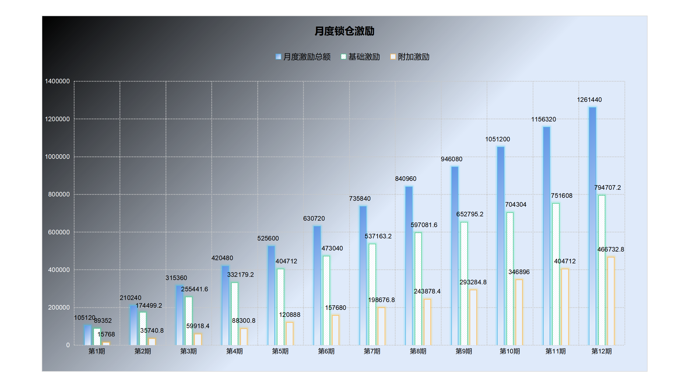

月度锁仓激励将分为基础激励和附加激励两部分，基础激励占比将逐月递减2%，附加激励则是逐月递增2%。首期基础激励将占月度锁仓激励的85%，附加激励则占15%；第2期占比则为83%和17%；第3期占比为81%和19%；依此类推……，第12期基础激励占比63%，附加激励占比37%。每月的附加激励由守护激励和竞争激励两部分，每月附加激励的70%作为当月的守护激励，30%作为当月的竞争激励。

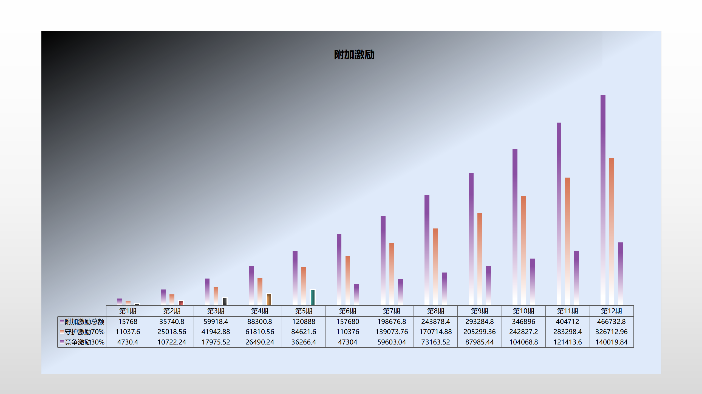

所有锁仓资金共享同一个基础激励池，每月的基础激励不断累积，在一年的锁定期结束时进行一次性清算，根据每笔锁仓的金额和锁仓时长按比例分配。

若当月新增锁仓总量达到当月基础激励的2.1倍，当月锁仓用户将获得守护激励。当月守护激励将对半分给A、B锁仓池，并按照各仓每笔锁仓的金额和锁仓时长按比例分配给当月新增锁仓资金。若当月未达到守护激励获得条件，当月守护激励将划归到生态基金。

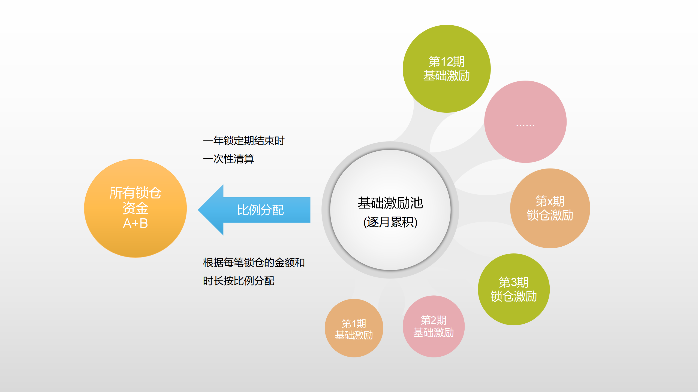

若当月新增锁仓量 A 仓大于 B 仓，且差额高于 14400 Meer，则 A 仓作为优胜者获得竞争激励；若当月新增锁仓量 B 仓大于 A 仓，且差额高于 14400 Meer，则 B 仓作为优胜者获得竞争激励；若差额小于14400 Meer，无优胜者，当月竞争激励划归到生态基金。获得竞争激励的锁仓池，按照本仓每笔锁仓的金额和锁仓时长按比例分配给当月新增锁仓资金。

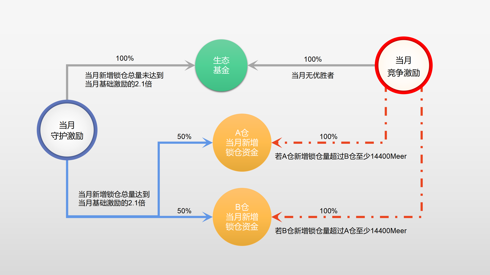

每一期发放月度锁仓激励时，将根据当月新增锁仓总量达标情况决定是否发放守护激励，同时根据A、B仓当月新增锁仓量情况判定竞争激励的归属。最终，若年度累积锁仓总量达到年度累积锁仓激励的2.1倍，即17218656 Meer，则将再额外增加 1051200 Meer 的荣耀激励作为奖励，约占可用资金总额的10%，并按比例分配给所有锁仓用户。因此，全体锁仓用户总计可获得 9250560 Meer 的锁仓激励。

基础激励为月度累积结果，锁仓期结束一次性结算，按照每笔锁仓资金的金额和锁仓时长按比例分配给所有锁仓资金。守护激励为月度结算激励，仅分配给当月新增锁仓资金。竞争激励亦为月度结算激励，仅分配给当月优胜仓内的新增锁仓资金。荣耀激励为年度触发性激励，仅当年度锁仓总量达到某一条件时获得，分配方式同基础激励。

此外，将拿出可用资金总额的3%用于团队激励，共计315360 Meer。对于未使用的可用资金总额部分，将暂存于生态基金，可用于网络后期的生态建设。

## 3.锁仓收益

所有锁仓用户获得的总收益将由三部分组成：来自基础激励池的基础收益；来自附加激励池的附加收益；来自荣耀激励池的年度奖励。附加收益包含了守护激励和竞争激励，且只有当月参与的锁仓的资金可以获得。

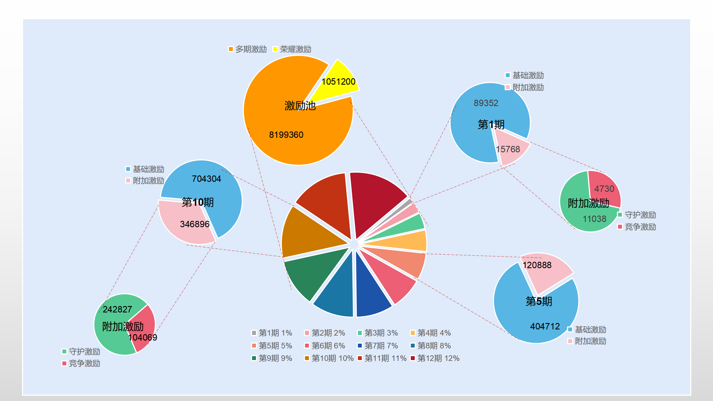

假设当前区块高度下全网共有n笔资金参与锁仓，第i笔加入锁仓的资金为 Li，加入锁仓的区块高度记为 ti，那么第i笔锁仓资金可标记为 (Li,ti)，i∈[1, n]。

由于不同用户参与锁仓的时间有所差别，为了收益计算的公平性，并保障早期参与锁仓用户的利益，我们加入有效锁仓时长作为锁仓收益计算的衡量。假设当前区块高度为T，则第i笔锁仓资金 (Li,ti) 的有效锁仓时长为 ((Ti-ti)。

若当前区块基础激励池中累积的基础激励为 Cbasic，则第i笔资金在当前区块获得的基础收益为：

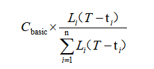

$\sum_{i=1}^n L_i(T-t_i)$ 为全网每笔锁仓资金的金额和锁仓时长的乘积的总和。

由于基础激励只有在锁仓期结束时统一进行一次性结算，因此基础收益计算的终止时间为锁仓结束时的区块高度 Tend。因此资金i的最终可获得的基础收益为：

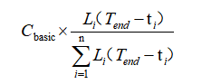

Cbasic 为12期基础激励的总和，即 Cbasic = C1,basic + C2,basic +...+ C12,basic。

对于某锁仓池中的资金j，将其加入的锁仓池标记为pool，pool为A或B，假设该资金是在第x个激励期加入的锁仓，则可将资金j标记为 (Lj,tj),pool,x)。由于每隔 90000 个区块为一个激励期，因此 x=tj/90000+1（这里为取整运算），在每一个激励期最后一个区块参与的资金将算入下一个激励期。

假设第x个激励期的起始区块为 Tx,start，结束区块为 Tx,end，则 Tx,start=90000(x-1)，Tx,end=90000x。因此对于所有第 x 期新增的锁仓资金，必满足 90000(x-1)≤tj<90000x。

由于附加激励仅限于当月新增锁仓资金共享，第x期的总附加激励包含守护激励 Cx,guard和竞争激励 Cx,vs。

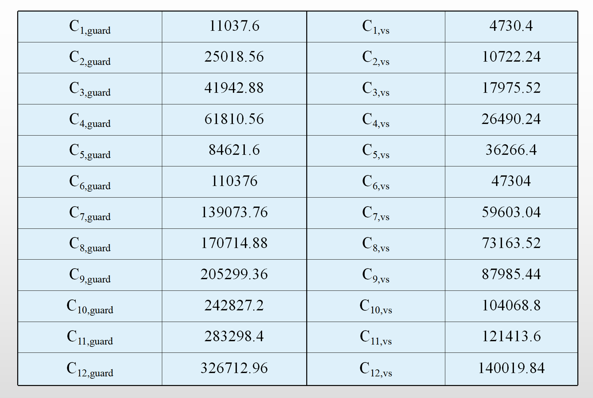

对于A仓第j笔新增资金 (Lj,tj),A,x)，当月可获得的附加收益为：

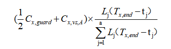

对于B仓第j笔新增资金 (Lj,tj),B,x)，当月可获得的附加收益为：

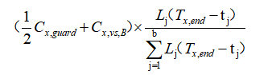

其中，a、b分别为A、B仓第x期新增锁仓资金总笔数。若当月竞争激励获得者为A仓，则Cx,vs,A=Cx,vs，Cx,vs,B=0。若当月竞争激励获得者为B仓，则Cx,vs,A=0，Cx,vs,B=Cx,vs，。

由于荣耀激励的分配方式和基础激励相同，可以看作是对基础激励的累加。若达到获得荣耀激励 Cglory条件，则锁仓资金i获得的基础收益将增加为：

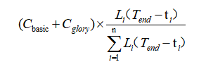

一个参与锁仓的用户，可能会在不同的时间向不同的锁仓池注入资金，因此用户的总锁仓收益将按照每笔锁仓资金的状态进行计算并求和。如下图：

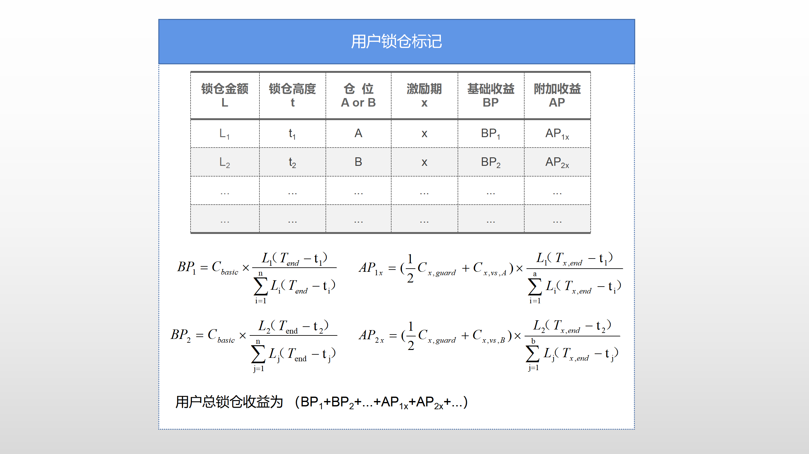
